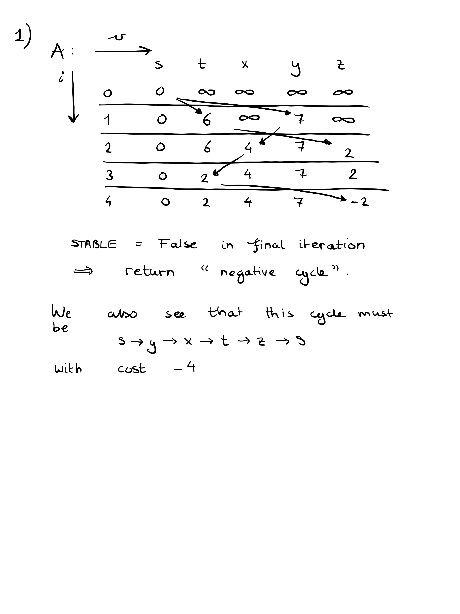

<script type="text/javascript" src="http://cdn.mathjax.org/mathjax/latest/MathJax.js?config=TeX-AMS-MML_HTMLorMML"></script>
<script type="text/x-mathjax-config"> MathJax.Hub.Config({ tex2jax: {inlineMath: [['$', '$']]}, messageStyle: "none" });</script>


## Ex 1.

## Ex 2.

Given:
- directed graph G = (V,E), with say `|V| = n`
- tree T = (V,E'), E' a subset of E
- starting node s in V.
- edge weights given by d : E -> R, possibly with d(e) < 0 for some e in E.

The algorithm first determines the current path lengths in `O(|V|+|E|)` time using a simple DFS:

```
distance = dict() # Or HashMap, or an array if the nodes 
                  #are just consecutive integers 0, 1, ... , n-1
distance[s] = 0
stack = emptystack()
stack.push(s)

while !stack.isempty(): 
    # this is done O(|V|) times, since in a tree there 
    # is only one unique path to each v in V, 
    # so v is explored only once via its unique parent

    v = stack.pop()
    for (v,w) in E' :
        # This is done O(|E'|) times, which is actually O(|V|) 
        # since spanning trees have precisely |V|-1 edges.

        distance[w] = distance[v] + d(v,w)
        stack.push(w)
```

When the distances `distance[]` are available, we perform one iteration (over v in V) of the 
Bellman-Ford algorithm. We do this in graph G, not T (considering all possible edges E) (this is kind of obvious, since if we run Bellman-Ford in T, there will be no effect as paths in trees are always unique)

If T contains for every v in V the shortest path from s to v in G, then this iteration should be stable.
We only have to prove that (2) if T is not the shortest-path tree, then the iteration should not be stable. In that case, we
have proven that Bellman-Ford is stable if and only if T is a shortest-path tree, which is what we want our algorithm to check.

How to prove the converse statement (2)?
Suppose that T is not the shortest-path tree. Then, let v in V be the node, along with the unique path pT from s to v in T, for which `pT = (s = v1, v2, ... , vk = v)` is not shortest, but the shortest path in G from s to v, say `pG = (s = u1, ... , u{l-1} ul = v)`, is such that the path `(u1, ... u{l-1})` lies in T. Can we assume this? Yes, since if not, then:
- for all v that have pT(s->v) not a shortest path s->v in G, an actual shortest path pG(s->v) = (s = u1, ... , u{l-1} ul = v) in G does not have the initial segment `(u1, ... u{l-1})` contained in T.
- but then since `(s = u1, ...  , u{l-1})` is a shortest path to u{l-1} in G, we must also have `(s = u1, ... , u{l-2})` not contained in T, and in this way we can continue until we discover that there is a node w such that (s,w) is the shortest path to w in G (just one edge), but this is not in T. Then, we are certain that one iteration of the Bellman-Ford algorithm will be unstable.

So assume that there is such a node v in V that `pT = (s = v1, v2, ... , vk = v)` is not shortest, but the shortest path in G from s to v, say `pG = (s = u1, ... , u{l-1}, ul = v)`, is such that the path `(u1, ... u{l-1})` lies in T. THen, one iteration of the Bellman-Ford algorithm will find that path, since we already have stored the cost of `(u1, ... u{l-1})` in distance, so we already "memoized the path `(u1, ... u{l-1})`" in a sense and one iteration will use that to improve the minimal distance of v = ul, by considering `distance[u{l-1}]` and `d(u{l-1},v)`.

One such an iteration, in our case, looks as follows:

```
for v in V:
    # This is done O(|V|) times

    for (w,v) in E:
        # This is done a total of O(|E|) times, since we 
        # only consider each edge E once
        # over all iterations
        if distance[w] + dist(w,v) < min:
            return false


```
Even though we iterate over edges within a loop over V, we see that if this is done efficiently using 
an adjacency list representation (where we store incoming nodes w in a list incoming[v]), we only perform 
an O(1) computation (conditional + random access to distance[w] and dist) for each v in V or e in E once, 
meaning a total complexity of O(|V|+|E|).

Together with the O(|V|) of the DFS calculation of the geodesic distance[] map/dict/array in T, we come to a 
complexity of O(|V|+|E|), i.e. linear.

## Ex 3.

```
k = 0

from (i)
   1   2   3   4   5   6
[[ 0. inf inf inf -1. inf]      1   to (j)
 [ 1.  0. inf  2. inf inf]      2
 [inf  2.  0. inf inf -8.]      3
 [-4. inf inf  0.  3. inf]      4
 [inf  7. inf inf  0. inf]      5
 [inf  5. 10. inf inf  0.]]     6

k = 1
[[ 0. inf inf inf -1. inf]
 [ 1.  0. inf  2.  0. inf]
 [inf  2.  0. inf inf -8.]
 [-4. inf inf  0. -5. inf]
 [inf  7. inf inf  0. inf]
 [inf  5. 10. inf inf  0.]]

k = 2
[[ 0. inf inf inf -1. inf]
 [ 1.  0. inf  2.  0. inf]
 [ 3.  2.  0.  4.  2. -8.]
 [-4. inf inf  0. -5. inf]
 [ 8.  7. inf  9.  0. inf]
 [ 6.  5. 10.  7.  5.  0.]]

k = 3
[[ 0. inf inf inf -1. inf]
 [ 1.  0. inf  2.  0. inf]
 [ 3.  2.  0.  4.  2. -8.]
 [-4. inf inf  0. -5. inf]
 [ 8.  7. inf  9.  0. inf]
 [ 6.  5. 10.  7.  5.  0.]]

k = 4
[[ 0. inf inf inf -1. inf]
 [-2.  0. inf  2. -3. inf]
 [ 0.  2.  0.  4. -1. -8.]
 [-4. inf inf  0. -5. inf]
 [ 5.  7. inf  9.  0. inf]
 [ 3.  5. 10.  7.  2.  0.]]

k = 5
[[ 0.  6. inf  8. -1. inf]
 [-2.  0. inf  2. -3. inf]
 [ 0.  2.  0.  4. -1. -8.]
 [-4.  2. inf  0. -5. inf]
 [ 5.  7. inf  9.  0. inf]
 [ 3.  5. 10.  7.  2.  0.]]

k = 6
[[ 0.  6. inf  8. -1. inf]
 [-2.  0. inf  2. -3. inf]
 [-5. -3.  0. -1. -6. -8.]
 [-4.  2. inf  0. -5. inf]
 [ 5.  7. inf  9.  0. inf]
 [ 3.  5. 10.  7.  2.  0.]]

```

## Ex 4.

(a) We use the conversion formula: $a_{i+1} a_i * c(a_i, a_{i+1})4 for i = 1, ... , k-1, giving

$$a_k = a_1 \prod_{i=1}^{k-1} c(a_i, a_{i+1})$$

(b) Under the condition that you can go "there and back again" with more gold than you started with (only Hobbits have been known to do this).

Meaning that you can go from a_1 to a_1 for some starting currency a_1 that you posses, i.e. a_k = a_1, where the product

$$\prod_{i=1}^{k-1} c(a_i, a_{i+1}) > 1$$

This is precisely the case if the graph G' contains a cycle, and if there is a negative cycle in the graph G' with respect to a different cost function, namely $d:E \rightarrow \mathbb R$ defined by

$$d(a_i,a_j) := -\log c(a_i, a_j)$$

Since note that: 
$$\sum_{i=1}^{k-1} d(a_i, a_{i+1}) = -\sum_{i=1}^{k-1} \log(c(a_i, a_{i+1}))  = -\log(\prod_{i=1}^{k-1} c(a_i, a_{i+1}))$$

Which is negative for a certain cycle a_1, ... a_k = a_1 if and only if for that cycle, $ \prod_{i=1}^{k-1} c(a_i, a_{i+1}) > 1$.

(c) We already know that if the n-th iteration of Bellman-Ford is unstable, then there is a negative cycle somewhere. We now need to detect only negative cycles that contain s, and have a way of retrieving this negative cycle containing s if it exists.

We do this by considering a `parent[]` dictionary/map/array, which maps a node in V to its unique parent in (**intermediate**, if not yet terminated) shortest-path-tree: and every time we find a better path (i.e. the solution turns out to be unstable), we update this dictionary:

```
Arbitrage-Finder(E, V, c)
let n = |V|
let d = negate . log . c // point-free!

parent = map :: V -> V

A = double[n+1][n]

A[0][s]   = 0
parent[s] = NIL

for v != s:
    A[0][v]   = INFINITY
    parent[v] = NIL


for i = 1..n:
    STABLE = true
    for v in V:
        for (w,v) in E:
            if distance[w] + d(w,v) < min:
                STABLE = false
                distance[v] = distance[w] + d(w,v)
                parent[v]   = w
                if v == s:
                    print "Free lunch found!"
                    let iter = s
                    while iter != w:
                        print parent[iter]
                        # this will print w, 
                        # then the parent of w, 
                        # ...
                        # finally, print s.
                        # So it prints the currencies
                        # in reversed order compared 
                        # to how you should make the 
                        # trades: w -> .. -> parent[w] -> w

    if STABLE:
        print "No free lunch"
        return nothing
```
(d)

No, consider the following counterexample (where we already applied a "- log" transform, so we just consider additive edge costs d and a total cost dist)


Running Dijkstra on this graph will explore and finish the nodes in the following order:

- First, we explore `$` and finish it immediately, enqueueing cheese and euro in the priority queue. dist[$] = 8, dist[euro] = 10, dist[cheese] = 11, Q = [(euro,10), (cheese,11)]

- Euro has the highest priority since it has the lower edge cost of 2 < 3. Therefore, it is explored first. dist[gold] remains 0, no other updates are done. So far, $, euro and gold are finished. Q = [(cheese,11)]

- Hence we explore cheese next and set dist[bitcoin] = -489, enqueue bitcoin so that Q = [(bitcoin,-489)].

- Explore bitcoin, set dist[euro] = -469.

We are done, because all nodes are now finished.

The problem: euro is not enqueued again after its cost was decreased. This is fine if we assume positive edge costs only, since then we can explore and finish nodes greedily with respect to their current shortest paths. But here, there was an edge of cost -500 hiding outside the "view of the priority queue", and therefore we finished all nodes leading back to gold (i.e. euro) before considering this pathway, thereby ignoring the lucrative cycle " gold -> $ -> cheese -> bitcoin -> euro -> gold ".