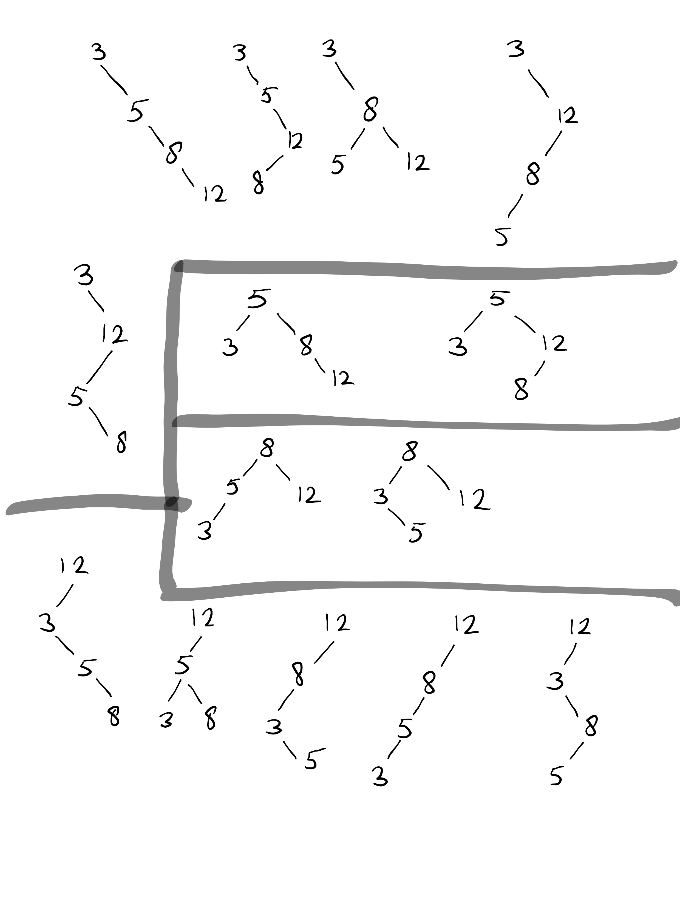
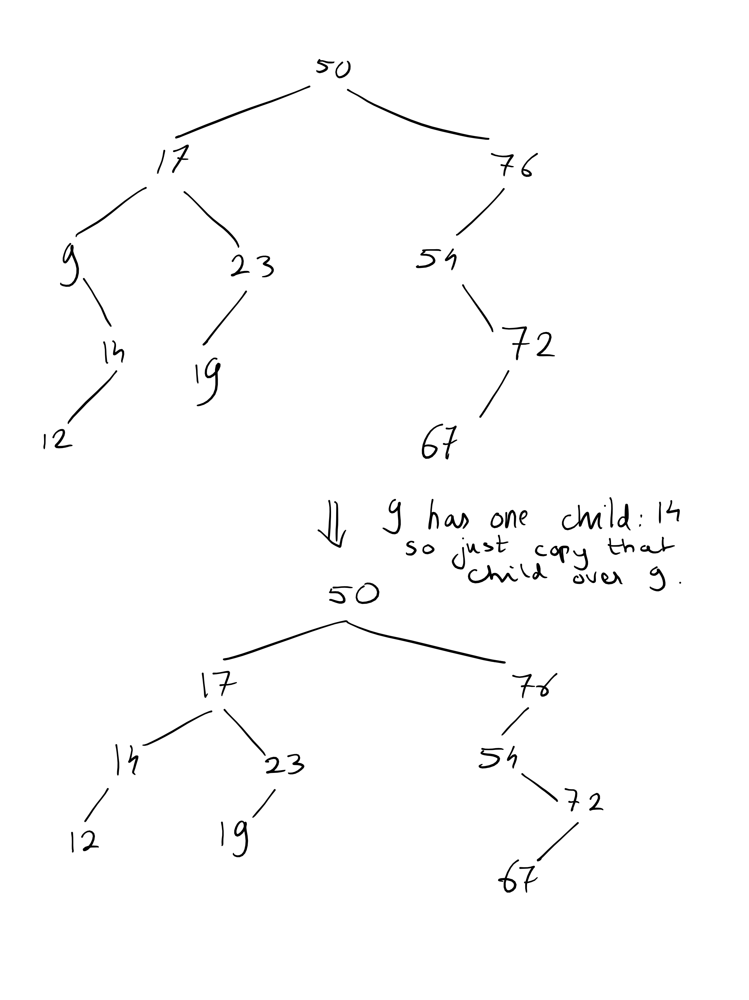
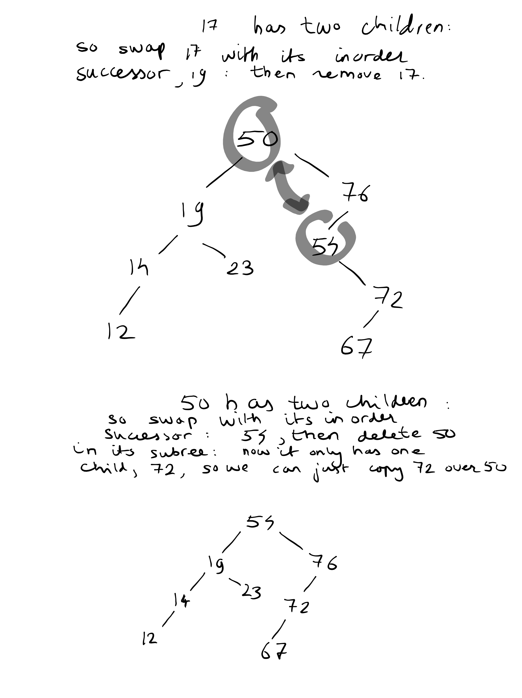
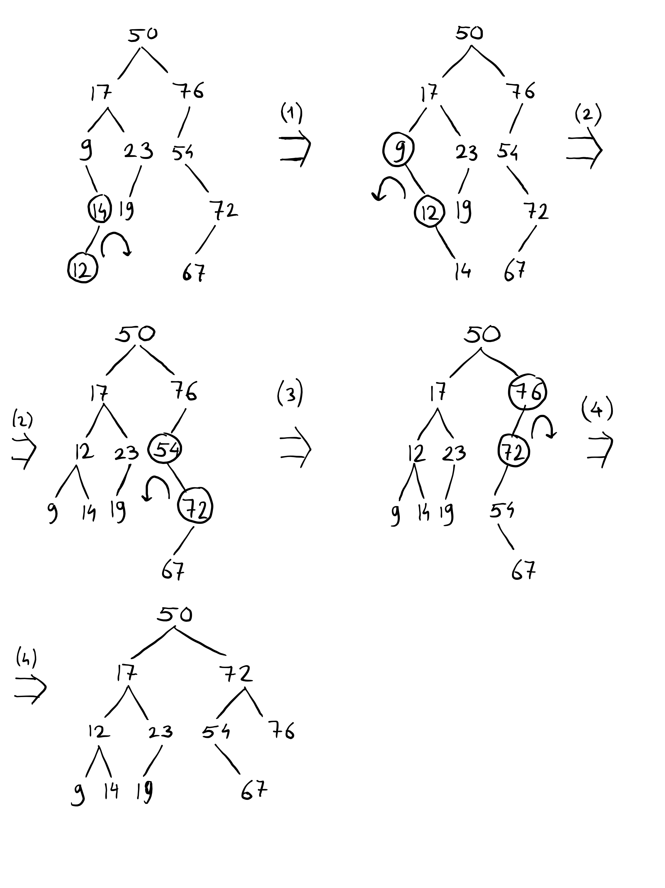

<script type="text/javascript" src="http://cdn.mathjax.org/mathjax/latest/MathJax.js?config=TeX-AMS-MML_HTMLorMML"></script>
<script type="text/x-mathjax-config"> MathJax.Hub.Config({ tex2jax: {inlineMath: [['$', '$']]}, messageStyle: "none" });</script>

## Ex. 1
(a)

It does not matter what the elements actually are: it just matters that these are 4 distinct elements that can be totally ordered, so for that matter we might as well look at the set {1,2,3,4}, etc.

How many different trees can we create from {1,2,3,4}? or maybe it is easier to consider the general problem: {1,...,n}? There are 4! (n!) permutations for the insertion orders (i.e. the order in which the elements arrive), but not all insertion orders give rise to a different tree, for example:

```
    3
  /   \
1       4
       /   
      2
```

Arises from the arrival order (3,1,4,2) but also (3,4,1,2) (where the elements arrive in order left to right). However, there is an induction argument:

- Call the number of ways a tree can be built from m elements {1,...,m}, call it T(m).

- Trivially, T(0) = 1
- If the element k (from 1, ... n) arrives first, then we know that all elements {1,..k-1} will end up in the left subtree, and all elements {k+1, ... , n} will end up in the right subtree. They will do that independently, so we apply the product rule: there are T(k-1) * T(n - k) ways that we can build a pair of trees on the elements {1,...,k-1}, {k+1,...,n} (note that the latter set bijects with {1,...,n-k} anyway, so we can use T(n-k) for that).
- Sum this over all k = 1, ... , n, because the arrival of the k-th element first will give rise to a different tree than the arrival of the j-th (j /= k) first, so we count mutually exclusive sets of trees.
- Conclude: the inductive case has:

$$
T(n) = \sum_{k=1}^n T(k-1)T(n-k)
$$

Let's solve this recursion using dynamic programming in O(n).

```
def nrBinTrees(n):
    array = [0] * (n+1)
    array[0] = 1
    for i in range(1,n+1):
        array[i] = sum([array[k-1]*array[i-k] for k in range(1,i+1)])
    return array[n]

print(nrBinTrees(4))
```

We get 14 trees.

(b)

For AVL trees, the requirement / invariant is that the height of the left subtree differs by at most 1 with that of the right subtree.
There is a recurrence, if we define T(n,h) to be the number of AVL trees on n nodes with height h:

$$
T(n,h) = \sum_{k=1}^n (T(k,h-1)T(k,h-1) + T(k,h-1)T(k,h-2) + T(k,h-2)T(k,h-1))
$$

With base cases:

$$
T(n,h) = 0 \quad if h>n \ if \ h \in \{0,1\} \ and \ h \neq n \\
T(0,0) = T(1,1) = 1
$$

Then we are interested in $\sum_h T(n,h)$. But this recursion has no known direct formula, so we will just draw all trees from the previous question and point out the b trees instead: the image is on the next page.

There are 4 AVL trees on the picture: these are <u>the trees with root 5 an 8 </u>(they are the ones in the rectangles).




## Ex. 2
Here are the drawings:




## Ex. 3
We mark the to be rotated nodes at every step with circles and emphasize the rotation direction with a curly arrow:



## Ex. 4

You can:

- Create two arrays of size n and m, respectively, which are created by traversing the tree inorder.  Inorder traversal is O(n), O(m) respectively.
- Merge the two arrays in O(n+m) time. They are both sorted, so we can just merge them as follows:

```python
def merge(flat_T1, flat_T2):
    n = len(flat_T1)
    m = len(flat_T2)
    merged_array = [0] * (n+m) # initialize array of size (n+m)
    t1_index = 0
    t2_index = 0
    while t1_index < m or t2_index < n:
        if flat_T1[t1_index] > flat_T2[t2_index]:
            merged_array[t1_index + t2_index] = flat_T2[t2_index]
            t2_index += 1
        else:
            merged_array[t1_index + t2_index] = flat_T1[t1_index]
            t1_index += 1
    return merged_array
```
This is O(m+n) because one of the indices gets updated every iteration and we stop when one of them is m, n respectively.

Then build from the merged array a balanced tree in O(m+n) time using the following recursive procedure:
- if the list is empty, the tree from that array is a NIL node

```python
class Node:
    def __init__(self, left, right, key):
        self.left  = left
        self.right = right
        self.data  = key

def build_balanced_tree(sorted_list):
    k = len(sorted_list)

    if k == 0:
        return NIL
    else:
        half = k//2
        return Node(
            left  = build_balanced_tree(sorted_list[:half]),
            right = build_balanced_tree(sorted_list[half_1:])
            key   = sorted_list[half]
            )
```
I.e. we pick a pivot element halfway in the list
- build a BStree on the first half of the list up to pivot (all elements less than the pivot, by sortedness of the list)
- build a BStree of the second half of the list after the pivot (all elements at least the pivot, by sortedness of the list)

Then put these as subtrees to the left, respectively right of a new node. Because all elements left of the pivot are less by sortedness, and to the right are greater than the pivot, this builds a correct BST. But why is it balanced? It means that at every node, the left and right subtree have a difference in height of at most 1. 

Well, this holds trivially if the sorted list has length 0. If it holds for a sorted list of length k for all k < l (strong induction hypothesis), then let's run this algorithm on a list with length l. Then the recursive calls will give balanced trees to the left and right of the pivot at l//2. But balanced trees on l//2 - 1, l - l//2 elements have a depth that is between floor(lg(floor(l//2))) and ceil(lg(ceil(l//2))), i.e. because the subtrees are balanced we know that their heights will thereby differ by at most 1! So we conclude that the procedure will also build a balanced BST on l elements, completing the induction hypothesis.

The complexity of the build-tree procedure can be found as follows:
- it is divide-and-conquer: picking the pivot is O(1), then come two recursive calls on problems of size (l/2). Hence T(l) = 2T(l), T(1) = O(1). We see that this means T(l) = O(l), i.e. the procedure is O(m+n).

This means that the entire algorithm, i.e. inorder flattening (O(n)+O(m)) + merging (O(m+n)) + tree building (O(m+n)) runs in O(m+n). It is correct because we proved that each of the three steps is correct.

## Ex. 5
If x.key <= k, we know that all nodes a in the left subtree A of x also have a key < x.key <= k, so that is alread x.left.size nodes, +1, since also x.key <= k. There may also be nodes larger than x (i.e. in the right subtree of x) that have key at most k. We can recursively find these with a call to RANK(x.right, k).

If x.key > k, then all nodes in the right subtree have key > x.key > k, so these can all be ignored when counting for the rank. We just have to find the number of nodes in the left subtree of x with key at most k, using a recursive call to RANK(x.left, k)

if x == NIL, we are in a leaf and the rank = 0 since there are no nodes in the subtree of NIL with key at most k.

```
RANK(x,k):
    if x == NIL:
        return 0
    if x.key <= k:
        return x.left.size + 1 + RANK(x.right, k)
    if x.key > k:
        return RANK(x.left, k)

```

Each call to RANK only consists of a constant time comparison operation, plus one recursive call which will always be called on a node that is one layer deeper than x (namely, either one of its children). This means that the recursion will terminate after $height$ recursive calls at most before hitting a base case (a NIL node).