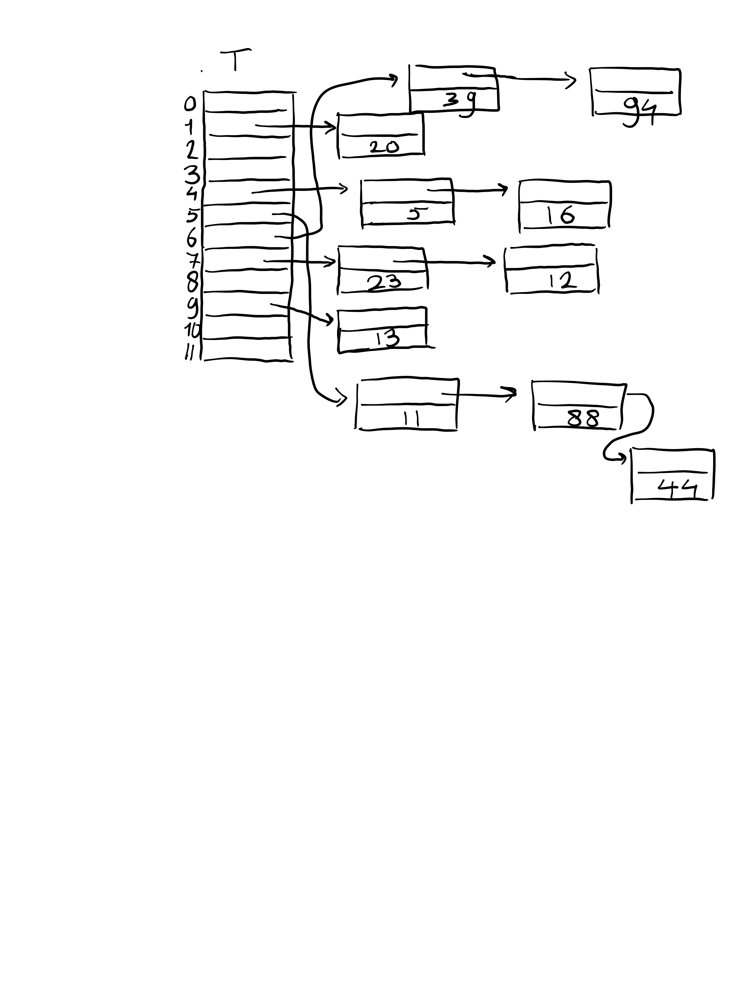

## Ex. 1
```
k   h(k)
12  7
44  5
13  9
88  5
23  7
94  6
11  5
39  6
20  1
16  4
5   4

```
We insert keys in the order from top to bottom and the chaining is done by inserting a collision into the head of the chain (list) (i.e. a cons operation). This gives the table:



## Ex. 2
(a)
Using linear probing, the hash function H on pairs K x {0,...,12} -> {0,...,12} is
```
H(k,i) := (h(k) + i) mod 13
```
hash table A:
```
h(8, 0) = 12
index not taken, insert:
table[12] <- 8
h(12, 0) = 11
index not taken, insert:
table[11] <- 12
h(40, 0) = 4
index not taken, insert:
table[4] <- 40
h(13, 0) = 1
index not taken, insert:
table[1] <- 13
h(88, 0) = 5
index not taken, insert:
table[5] <- 88
h(45, 0) = 6
index not taken, insert:
table[6] <- 45
h(29, 0) = 10
index not taken, insert:
table[10] <- 29
h(20, 0) = 9
index not taken, insert:
table[9] <- 20
h(23, 0) = 5
index is already taken, increase i to 1
h(23, 1) = 6
index is already taken, increase i to 2
h(23, 2) = 7
index not taken, insert:
table[7] <- 23
h(77, 0) = 11
index is already taken, increase i to 1
h(77, 1) = 12
index is already taken, increase i to 2
h(77, 2) = 0
index not taken, insert:
table[0] <- 77
```
Final hash table:
```
0        | 77    |
1        | 13    |
2        | -     |
3        | -     |
4        | 40    |
5        | 88    |
6        | 45    |
7        | 23    |
8        | -     |
9        | 20    |
10       | 29    |
11       | 12    |
12       | 8     |
```
For all items except 23 and 77, we only had to hash once (no collision): one total hash. For 23, we had to rehash twice, meaning three total hashes. For 77, we had to rehash twice: so three hashes. 


(b)

hash table B:
```
h(8, 0) = 12
index not taken, insert:
table[12] <- 8
h(12, 0) = 11
index not taken, insert:
table[11] <- 12
h(40, 0) = 4
index not taken, insert:
table[4] <- 40
h(13, 0) = 1
index not taken, insert:
table[1] <- 13
h(88, 0) = 5
index not taken, insert:
table[5] <- 88
h(45, 0) = 6
index not taken, insert:
table[6] <- 45
h(29, 0) = 10
index not taken, insert:
table[10] <- 29
h(20, 0) = 9
index not taken, insert:
table[9] <- 20
h(23, 0) = 5
index is already taken, increase i to 1
h(23, 1) = 0
index not taken, insert:
table[0] <- 23
h(77, 0) = 11
index is already taken, increase i to 1
h(77, 1) = 0
index is already taken, increase i to 2
h(77, 2) = 2
index not taken, insert:
table[2] <- 77
```
Final table:
```
0        | 23    |
1        | 13    |
2        | 77    |
3        | -     |
4        | 40    |
5        | 88    |
6        | 45    |
7        | -     |
8        | -     |
9        | 20    |
10       | 29    |
11       | 12    |
12       | 8     |

```
Number of hash calls per element: For all elements except 23 and 77, we did not have to rehash, so only one hash call. For 23, we did 2 total hash calls. For 77, we did 3 total hash calls.

## Ex. 3
Clearly h_1 is much better. 

- h_2 has as its range {0,1,2}, because for 0 <= x <= 29, we have 0 <= x//3 < 3. This means that 7 indices in the hash table are never mapped to (namely 3, ..., 9), and all insertions will happen in 0,1,2, with a higher probability of collission and inevitably some long chains (i.e. long lookups of O(chainlength)).

- On the other hand, h_1 has range {0,...,9} and if the keys are uniformly distributed over {0,...,29}, then the remainders modulo 10 are uniformly distributed over {0,...,9} (with 3 keys mapping to each index via h_1, e.g. 1, 11, 21 map to 1 via h_1, etc.). So all indices are used and chains will grow much slower with the load factor n/m = n/29 (where n is the number of elements inserted).

## Ex. 4
The table T starts out empty. The algorithm, in each iteration, looks up A[i] in T, for i = 0, ... , n-1. If A[i] is present, we should returns true, because the value A[i] was inserted at an earlier iteration, so for a j < i it holds A[j] = A[i]. Otherwise (I will just assume that if a key k is not present, T.LOOKUP(k) will return some NIL value), insert A[i] into T, also in O(1) average time. In other words, we use the table as an unordered set (the values that are inserted at a key are either ignored or some dummy value; it only matters whether the key is present or not). 
It two numbers k, l, are equal, since a hash function is just a function h(k) = h(l) obviously, so if there is a collision, check the elements that were already inserted. 

```
anydoubleElement(A : array[int,n]): # n times
    for i = 0,...,n-1:
        if T.LOOKUP(A[i]) != NIL:   # O(1) average time
            return True
        else:
            T.INSERT(A[i])          # O(1) average time
    return False
```
Or, in python:
```python
def anydoubleElement(A : list[int]):
    T = set() # We will ignore the values of a dict anyway, 
              # and python's set is implemented as a dict without values
    for a in A:
        if a not in T:
            T.add(a)
        else:
            return True

    return False

```

Both checking presence and inserting elements will on average take O(1) and can never take more time, since that can only mean that there is a collission of O(n) size, which contradicts the assumption of simple uniform hashing, because such a collision consists of O(n) different keys (otherwise the algorithm will return early anyway): and O(n) different keys should map to O(n) different indexes by the uniform hashing assumption. n iterations of on average O(1) operations gives an O(n) algorithm in the average case.

## Ex. 5
We use T as an associative array where the words are keys and the values are integers, which are counts. If a key (word) in not yet present, add it and set its count to 1. If it is present, increment its count by 1.
This requires an iteration over all the words, which is O(n). Then, we can keep an intermediate list of 4 words that should become the list of most frequent words. These are sorted by bubbling up a word (then removing the first word, with the smallest count) in the top four list, based on its count, if it did not occur already in the top 4 list, and do this for all n words. The bubbling up requires a constant number of comparisons and swaps (namely, at most 4 when the word has a new maximum count), so is O(1). This makes the algorithm O(n + O(1) * n) = O(n) still. We can even write this in python:

```
def mostFrequent4(document : list[str]) -> int :
    count : dict[str] = dict()           # n times
    for word in document:
        if word in count:    # this is, in pseudo-code, a LOOKUP, O(1)
            count[word] += 1 # this is INSERT, O(1)
        else:
            count[word] = 1
    # topFour is the list of top 4 most frequent words,
    # sorted on frequency where topFour[0] is most frequent.
    topFour : list[str] = []
    for word in document:
        if word not in topFour: # O(4) checks for equality, so constant time!
            topFour.append(word)
            i = len(topFour) - 1 # this is 4 once topFour is saturated, but it starts out empty
            while i > 0: # O(4) = O(1) iterations
                if count[topFour[i]] > count[topFour[i-1]]: # two O(1) lookups, O(1) comparisons and O(1) swaps.
                    topFour[i], topFour[i-1] = topFour[i-1], topFour[i]
                    i -= 1
                else: break
            if len(topFour) > 4:
                topFour.pop()
    return topFour

document = ["Hello", "World", "cheese", "cheese", "cheese", "eggs", "ham", "ham", "onion", "youtube", "onion", "World", "World"]
print (mostFrequent4(document))
```

There may be more elegant solutions that are essentially like counting sort, but this solution is theoretically sound and theoretically O(n), so it is what the problem asked for.