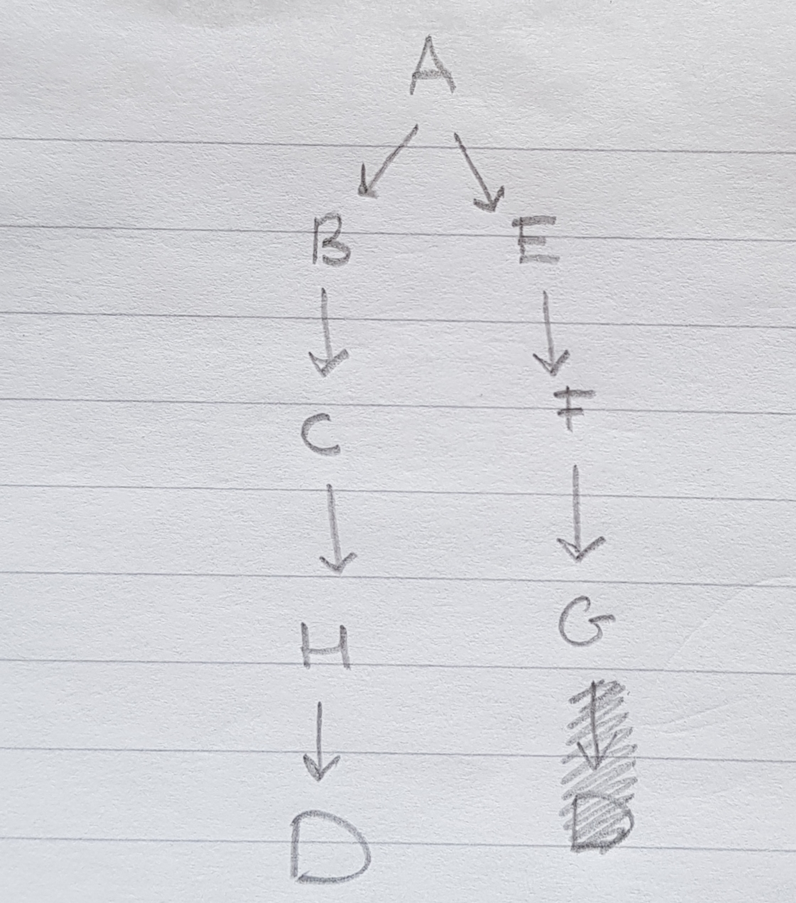
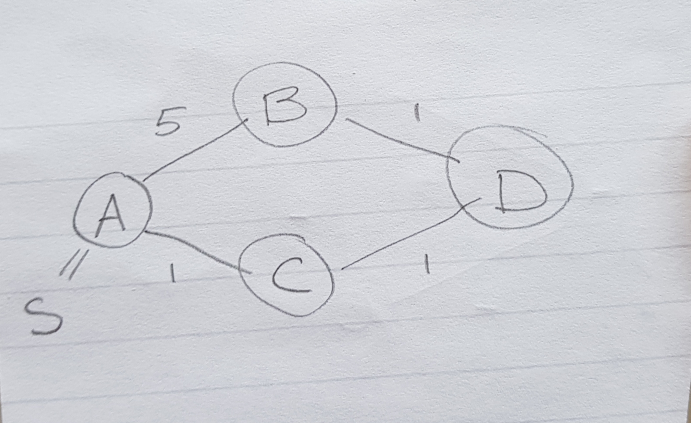

1. *Run the BFS algorithm on the directed graph below, using vertex A as the source. Show all distances
and the BFS tree.*

I will show the states of the path length (edge count) array and the queue at every stage. The queue is displayed with curly braces, its frontier is on the right and its back is on the left:

- `A = 0`, `{A}`
- `A = 0, B=1, E=1`, `{B, E}`
- `A = 0, B=1, E=1, F=2`, `{F, B}`
- `A = 0, B=1, E=1, F=2, C=2`, `{C, F}`
- `A = 0, B=1, E=1, F=2, C=2, G=3`, `{G, C}`
- `A = 0, B=1, E=1, F=2, C=2, G=3, H = 3`, `{H, G}`
- `A = 0, B=1, E=1, F=2, C=2, G=3, H = 3`, `{H}`
- `A = 0, B=1, E=1, F=2, C=2, G=3, H = 3, D=4`, `{D}`
- `A = 0, B=1, E=1, F=2, C=2, G=3, H = 3, D=4`, `{}`
- Queue empty, so done

The BFS tree is:



2. *Show how to implement a queue using two stacks.*

A pseucode implementation (explanation follows below):
```
Queue<E> {
    attribute Stack outStack;
    attribute Stack inStack;

    method void enqueue(E x) {
        inStack.push(x)
    }

    method E dequeue() {
        if outStack.isEmpty() :
            if inStack.isEmpty :
                ERROR : Queue is empty!
            else :
                while not instack.isEmpty():
                    outStack.push(inStack.pop())
                return outStack.pop()
    }

    method bool isEmpty() {
        return outStack.isEmpty() and inStack.isEmpty
    }
}

```

Explanation: we split the queue in two parts: 

- The front end of the queue where new elements are enqueued, is oriented so that the **Last** entered element is on the **Top**. This is the inStack: when we enqueue a new element, we push it to this stack.

- the back end of the queue, where elements are dequeued, is oriented so that the **First** entered element is on the **Top**. This is the outStack: when we dequeue, we pop an element from this stack.

So far so good, but what if one of the stacks becomes empty?

- If the inStack becomes empty, we don't need to do anything: we can just wait for new elements to be enqueued and push these to the inStack.

- If the outStack becomes empty, we cannot pop anymore from this stack when we want to dequeue from the queue. So we need to fill it: we do this by popping one-by-one the elements from the inStack and pushing them to the outStack. We need to do this until the inStack is empty, so that the last enqueued element (which is at the bottom of the inStack) is now at the top of the outStack. This is the only way to maintain the two *invariants*:

1. that the outstack has elements sorted LIFO and 
2. the instack has elements sorted FIFO.

*Analyze the running time of the queue operations.*

We see that 

- `enqueue` has the complexity of one stack `push`, which is constant time if we implement a stack as a singly-linked list for example.
- `dequeue` has different complexities depending on the situation:
    1. If the `outStack` is empty, we have to perform `size(Queue)` = `size(inStack)` `pop`s from `inStack` and even so many `push`es to `outStack`.
    2. If the `outStack` is not-empty, we can `pop` from `outStack` in constant time.

    But notice that in any case, every element that enters the `Queue` is only once popped from `instack` and pushed to `outstack`. In other words, on average we only have one `push`+ `pop` to/from inStack associated with each `enqueue` and one `push` + `pop` to/from outStack associated with `dequeue`. Hence the average-time performance of `dequeue` is still constant time.


3. *Let us consider the following (incomplete) program:*
    1. *Complete the functions and procedures above*
```
stack: array of strings
no_elements: integer

//creates empty stack
procedure createStack()
    no elements = 0
    SetLength(stack, no elements) //sets size of the array of strings ”stack” to ”no_elements”
end procedure


//tests if the stack is empty (may return true of false)
function isEmpty()
    return no_elements == 0
end function

//pushes "element" to the stack
procedure push(element)
    stack[no_elements] = element
    no_elements++
    // This is the only correct way: because 
    // if we increase no_elements before we push,
    // we skip adding an element at 
    // index 0 if we add to the empty stack
end procedure

//removes and returns last element on stack
function pop()
    no_elements--
    return stack[no_elements]
end function

//returns top element
function top()
    return stack[no_elements - 1]
end function

//displays elements in the stack
//note: upside down
procedure display()
    for i = 0, 1, ... no_elements - 1
        WriteLn(stack[i])
end procedure
```

*Give the complexity of each function.*

- `createStack()`: constant time.
- `isEmpty()`: O(1) (one integer comparison)
- `push()`: O(1) (one integer arithmetic and one memory write)
- `pop()` : O(1),  (one integer arithmetic and one memory read)
- `top()` : O(1),  (one memory read)
- `display()`: O (`no_elements`)

*What is displayed on the screen?*

```
AAA
AAA
BBB
CCC
CCC
AAA
BBB
```

*Write a function empty(), emptying the stack.*

```
function empty()
    no_elements = 0
end function
```

4. 
    1. *Show that, if G has an odd-length cycle, then there is no 2-coloring.*

    Lemma: for every path (v1, ... , vk) (k odd and > 1, so starting from k=3) we show with induction to k  that for any 2-colouring vk needs to be of the same colour (say, c1) as v1.

    IB for k=3, we have: v1 is of colour c1, then v2 must be of the other colour c2, but since it is the neigbour of v3, v3 needs to be of colour v1 again.

    IH suppose this is the case for some k. Then we look at the case k+2. Since we already know that vk hast to be c1, the colour of v1, we have that vk+1 needs to have the colour c2, and since vk+2 is neighbour of vk+1, it again needs to be of colour c1. QED.

    This lemma gives us the needed contradiction: assume that there is a valid 2-colouring and that there is a cycle (v1, ... , vk, v1) with k odd, then since (v1, ... vk) is a path, vk has the same colour as v1, but then there are two neigbours (since vk is adjacent to v1) with the same colour, making the 2-colouring invalid. Contradiction. There can be no 2-colouring.

    2. *Assume G has no odd-length cycles. Use BFS algorithm to find an appropriate 2-coloring for G and argue that it is correct.*

    Pick a root node v0 in V arbitrarily. Paint it red.
    
    First use BFS to find, from every node v in the graph, a shortest path to to the root node. Such a shortest path may or may not be unique, but its length is always unique because it is the shortest possible length (we define the length as the edge count).

    If the shortest path is of odd length, we know that necessarily (by the lemma), v has to have the same colour as v0, so red.

    If the shortest path is of even length, then we know that there is a path (v0, ... , vk, v) to v, and vk is already coloured because p = (v0, ... , vk) is the shortest path from v0 to vk (if it is not the shortest path, but rather some other path q is shortest, then (q, v) is a shorter path from v0 to v than (p, v), which is a contradiction!) So vk is red, and hence v as a neighbour of vk, has to be blue.

    Since the shortest path length is a unique number, the colour of each node v is uniquely defined. But how do we know that no neighbouring nodes are now of the same colour?

    Suppose, for a contradiction, that there are neighbouring nodes of the same colour, v and w. Then both of them have either an even or odd path to v0. But then (v0, ... , v, w, ... v0) is a cycle of length odd + odd + 1 = 2 * odd + 1 = odd, or of length even + even + 1 = 2 * even + 1 = odd, i.e. there is a cycle of odd length in G. And we assumed that G had none of these, contradiction.

    So there can be no neighbouring nodes of the same colour and this algorithm is correct. 
    
5. *What do you think of Eager’s proposal? Argue why it is correct or provide a counterexample.*

Eager's proposal is:

```
enum State : = { UNDISCOVERED , DISCOVERED }

void bfs ( G , v )

    // initialize
    for each u in vertex (G) unequal v
        explored [u] : = UNDISCOVERED
        predecessor [u] : = null
        d [u] = 0

    explored [v] : = DISCOVERED
    predecessor [v] : = null


    Q : = emptyQueue
    enqueue (Q , v)
    
    // main loop
    while (! isEmpty (Q))
        u : = dequeue (Q)
        for each w in adjacent (u)
            if (explored [w] == UNDISCOVERED)
                explored [w] : = DISCOVERED
                predecessor [w] : = u
                enqueue (Q , w)
                d[w] := d[u] + w(w, u).
    
```

There is one potential hazard with this algorithm: 
- once we have discovered a node w, we fix its d[w] by d[u] + w(w, u), which is the distance computed from the node that we explored w from. But what if there is a shorter path via another node, say u' ? In that case, we don't get to update d[w] anymore because we can only do that once, namely if `explored [w] == UNDISCOVERED`.

So, if a path p from A to B has a shorter length w(p), but it is not the shortest path in terms of **number of edges**, then the shortest path in terms of **number of edges** will be explored first due to the queue, to which vertices with **number of edges** -distance are enqueued and thus also visited first.

This provides us with relatively simple counterexample. Consider the graph with nodes A,B,C, where A is s, the starting point:




Computation Steps:

1. We start in A and enqueue it. d[A] = 0
2. We explore the front of the queue, A. This will add B and C and set d[B] = 5 and d[C] = 1 and set them to `DISCOVERED`. The order in which B and C are added to the queue depends on the order in which they appear in the adjacency list of A.
3. We explore either B first, setting D to `DISCOVERED` and d[D] = 6, or we explore C first, setting D to `DISCOVERED` and d[D] = 2. Either way, D is added to the queue and set to discovered

We then continue with D but there is nothing left to be discovered. 

The problem is that d[B] = 5. But the shortest path is clearly of length 3. Because the shortest path to B has 3 edges but there is a path of 1 edge (A, B), we will never get to register the shorter path in d[]. This makes Eager Dukstra's algorithm too Eager.


