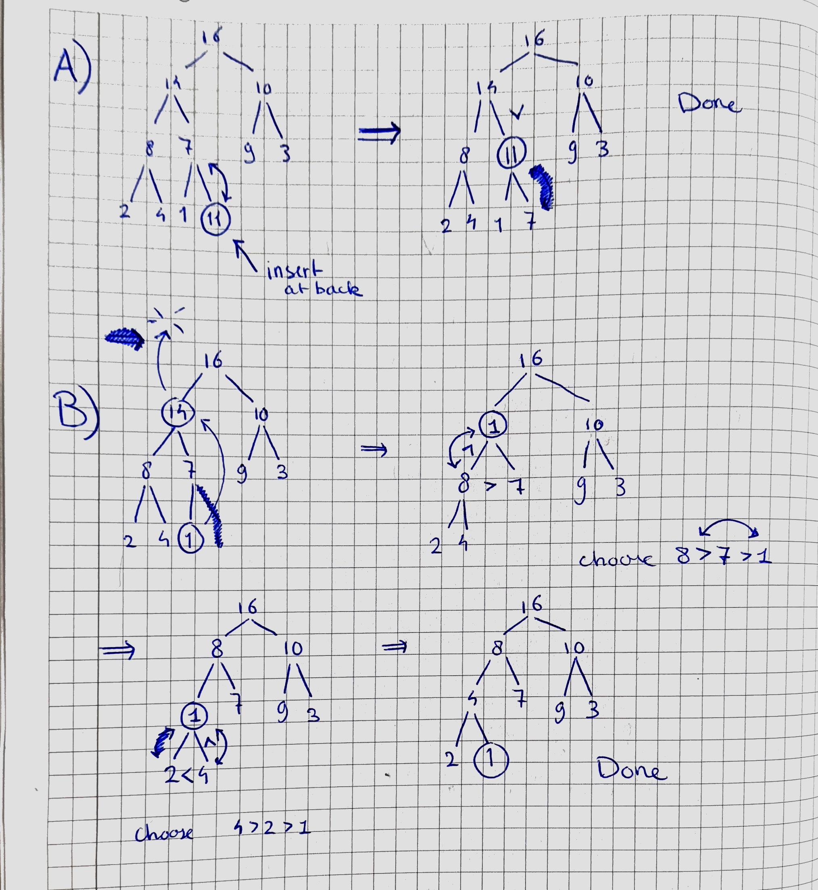

<script type="text/javascript" src="http://cdn.mathjax.org/mathjax/latest/MathJax.js?config=TeX-AMS-MML_HTMLorMML"></script>
<script type="text/x-mathjax-config"> MathJax.Hub.Config({ tex2jax: {inlineMath: [['$', '$']]}, messageStyle: "none" });</script>

## Exercise 1

1. Q = [{A,0}, {B,inf}, {C,inf}, {D,inf}, {E,inf}, {F,inf}, {G,inf}, {H,inf}]

2. {A, 0}, Q = [{B,5}, {C,inf}, {D,inf}, {E,4}, {F,inf}, {G,inf}, {H,inf}]

3. {A, 0}, {E, 4}, Q = [{B,5}, {C,inf}, {D,inf}, {F,15}, {G,inf}, {H,inf}]

4. {A, 0}, {E, 4}, {B, 5}, Q = [{C,11}, {D,inf}, {F,15}, {G,15}, {H,inf}]

5. {A, 0}, {E, 4}, {B, 5}, {C,11}, Q = [{D,12}, {F,15}, {G,15}, {H,28}]

6.  {A, 0}, {E, 4}, {B, 5}, {C,11}, {D,12}, Q = [{F,15}, {G,15}, {H,24}]

7. {A, 0}, {E, 4}, {B, 5}, {C,11}, {D,12}, {F,15}, Q = [{G,15}, {H,24}]

8. {A, 0}, {E, 4}, {B, 5}, {C,11}, {D,12}, {F,15}, {G,15}, Q = [{H,24}]

9. {A, 0}, {E, 4}, {B, 5}, {C,11}, {D,12}, {F,15}, {G,15}, {H,24}, Q = []

## Exercise 2
We can transform the costs by taking a $-\log$ such that they form an additive structure and are nonnegative: in that case we can solve the problem using Dijkstra.

More precisely: let $d(v,w) = -\log(r(v,w))$ for all $v,w \in V$. Note that we set $d(v,w) = \infty$ if there is no edge $(v,w)$.

We see that since $r\in (0,1)$, this we can do and $\log(r) < 0$ so $-\log (r(v,w)) > 0$ for all $v,w$ for which we have a connection.

Now solve the shortest path for this nonnegative metric $d$ problem using Dijkstra.

We show that the found path $p$, which by correctness of Dijkstra  minimizes $c(p) = \sum_{i=1}^{k-1}-\log(r(v_i, v_{i+1}))$, also minimizes $r(p)$.

Suppose for a contradiction that there is a path $q = (w_1, ... , w_n)$ which has an even higher reliability, that is $r(q) = \Pi_{i=1}^{k-1}r(w_i, w_{i+1}) > r(p) = \Pi_{i=1}^{k-1}r(v_i, v_{i+1})$

Then we take the $-\log$ on both sides, and since the $\log$ is monotonous, the $-\log$ will flip the "$>$" to a "<".

We can take logs since these reliabilities are $>0$ (if they are 0, this means that there is no path between $v$ and $w$ so any shortest path has lenght $\infty$, depending how you want do define it), and this gives:

$\sum_{i=1}^{k-1}-\log(r(v_i, v_{i+1})) = -\log(\Pi_{i=1}^{k-1}r(w_i, w_{i+1})) = -\log(r(p)) < -\log(r(q)) = -\log(\Pi_{i=1}^{k-1}r(w_i, w_{i+1})) = \sum_{i=1}^{k-1}-\log(r(w_i, w_{i+1})) $

So we see that this leads to a shorter path with respect to $d$, and since Dijkstra was correct, this gives us a contradiction. In other words, the found path $p$ is necessarily the most reliable.

## Exercise 3
(a)
Suppose that we store a d-ary heap in an array A.
We store the root in A[0].
We store the i-th child (where 1 <= i <= d) of a node j  in A[d * j + i]

This gives no collisions, because if d * j + i = d * j' + i', then (i - i') = d * (j - j') and since 1 - d <= (i - i') <= d - 1, 
and it must be divisible by d since d * (j - j') is, we have to have (i - i') = 0 because there are no other multiples of d in [1-d, d-1].
And thus i = i' and from this also follows j = j'.

For the parent of n, we look at a j s.t. d * j + i = n for some i in [1, d]. We simply see that this gives two cases:
- i = d, in which case j = n/d - 1
- i < d, in which case n < j*(d+1), so j = (n - i)/d = ceil(n/d) - 1 

Actually, both cases amount to j  =  ceil(n/d) - 1, or j = (n `div` d) (integer division).

(b)
We need k layers, where $\sum_{i = 0}^{k} d^i \geq n$, and this sum is is $(d^{k+1}- 1)/(d - 1)$ (geometric sum). We need to solve this for $k$, giving $d^{k+1} \geq n(d-1) + 1$
so $k = ceil(\log_d(nd - n +1)) - 1$

(c)
We use methods for getting a parent or i-th child of node p:

```
int parent(int j):
    return j `div` d

int child(int p, int i)
    return p * d + i


```
These are constant time.

Note that these functions may give indices that are out of range, or not valid, like parent(0) = 0. We will however never call functions on such values.

Extracting the max element is just taking A[0], replacing it with the last element of the heap, decreasing the heap size and restoring the heap-property using max-heapify (the latter we have to reimplement to support d children instead of 2).

```
extract-max(A):
    if A.heapsize < 1:
        throw ERROR
    else:
        max = A[0]
        A[0] = A[A.heapsize - 1]
        A.heapsize = A.heapize - 1
        max-heapify(A, 0)
        return max
```

Where max-heapify(A,n) swaps n if any of its children is larger, and if so it will swap n with its biggest child, so that A[n] will be larger than all its children, and then it recursively calls max-heapify(A, biggest):

```
max-heapify (A, n):
    biggest = i
    for (int i = 1; i <= d; child(n,i) < A.heapsize):
        if A[child(n,i)] > A[biggest]:
            biggest = child(n,i)
    if biggest != i:
        swap(A, i, biggest)
        max-heapify(A, biggest)

```
And this will restore the invariant.

The running time: extract-max consists of the constant-time operations 

```
max = A[0]
A[0] = A[A.heapsize - 1]
A.heapsize = A.heapize - 1
return max
```

And `max-heapify(A,0)`. Max-heapify will at most be applied D times where D is the depth of the heap, so in the order of $\log_d(dn-n+1)$. Every application of max-heapify() features iteration over d children to find the maximum of the parent and its children, So in total $T  =O(d(\log_d(dn-n +1) +1)) = O(d\log_d(dn-n +1))$ 

(d)
We just insert k in the back and then push it up the heap until it is at the top or its parent is larger than k:

```
insert(A, k):
    A.heapsize ++
    index = A.heapsize - 1
    A[index] = k
    while(index != 0 and A[parent(index)] > k)
        swap(A, index, parent(index))
        index = parent(index)
```

The operations of incrementing A.heapsize and putting k at A[index] are constant time. We need to push k up the heap at most D times, and swapping /relabeling are constant-time, so the complexity is $T = O(D) = O(\log_d(dn-n +1))$

(e)

If $k >= A[i]$ we have cases $k == A[i]$$ in which case we don't have to restore a heap property for it is not invalidated, an the case $k > A[i]$ in which case we may have to push up $k$, so we do the same pushing operation as in insert(A, k), except that we start from index = i instead of index = heapsize

```
increase-key(A,i,k):
    if i >= A.heapsize :
        throw OUT_OF_BOUNDS_ERROR;
    if k < A[i]
        throw ERROR;
    if k == A[i]
        return;
    if k > A[i]
        index = i
        A[index] = k
        while(index != 0 and A[parent(index)] > k)
            swap(A, index, parent(index))
            index = parent(index)

```

In the worst case, we have to push up all the way from the bottom of the heap, which only happens when we change the key of a node in the lowest layer to a value larger than the maximum element (at A[0]). In any case, this bounds the running time by $T = O(D) = O(\log_d(dn-n +1))$

## Exercise 4

We only need to output `easiest[v]`. So we store an array of `easiest[v]` along `d[v]`, and **ONLY** when we find a shorter path using Dijkstra, we consider whether this path has less edges than easiest[v] currently has, in which case we update easiest[v] to the number of edges in that path.

So we add some extra bookkeeping, but we still need to find the shortest paths and only when there are multiple shortest paths to v, we should update easiest[v] to the lower value for the edge count. It is just Dijkstra with one extra step in the main loop:

```
void dijkstra(G,v)

    // initialization
    d[v] = 0
    predecessor[v] = NULL
    // added:
    easiest[v] = 0

    Q.enqueue({v,0})


    for u in Vertex(G) unequal v
        predecessor[u] = null
        d[u] = INFINITY
        Q.enqueue({u, INFINITY})
        // added:
        easiest[u] = INFINITY


    // main loop
    while (!Q.isEmpty())
        u = Q.dequeue()
        for each w in adjacent(u)
            new_path_length = d[u] + c(u, w)
            new_nr_edges
            if new_path_length <= d[w] && new_nr_edges < easiest[w]:
                d[w] := new_path_length
                easiest[v] = new_nr_edges
                predecessor[w] := u
                Q.decreasePriority({w, new})
    

```

We don't change how we sort the elements in the Queue since the length of the path to v is still determining for when we want to explore v. But we only update the predecessor, d[w] and easiest[w] if new_path_length <= d[w] && new_nr_edges < easiest[w]. 


## Exercise 5
(a) + (b):

