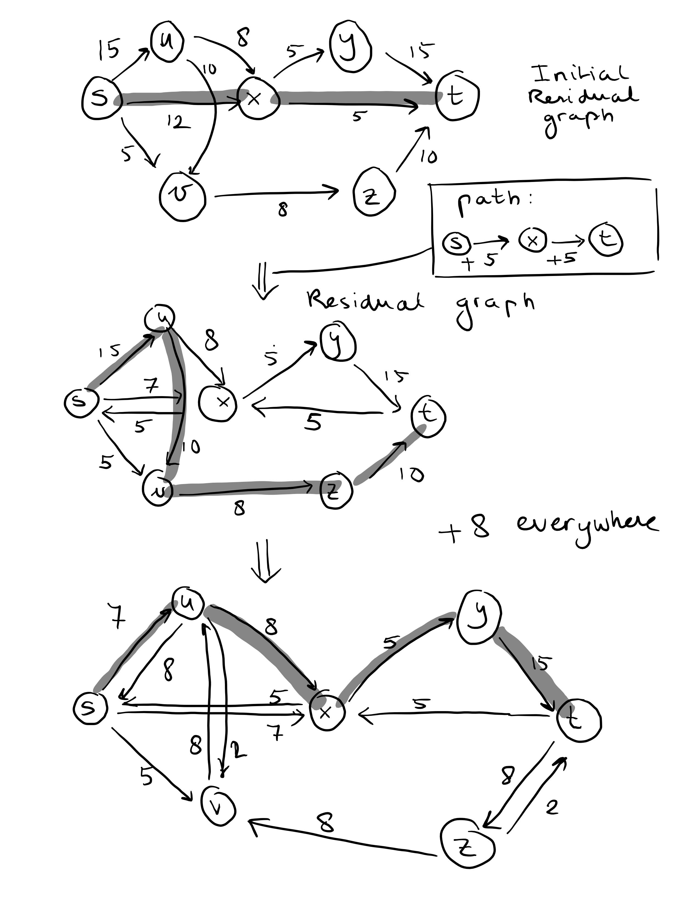
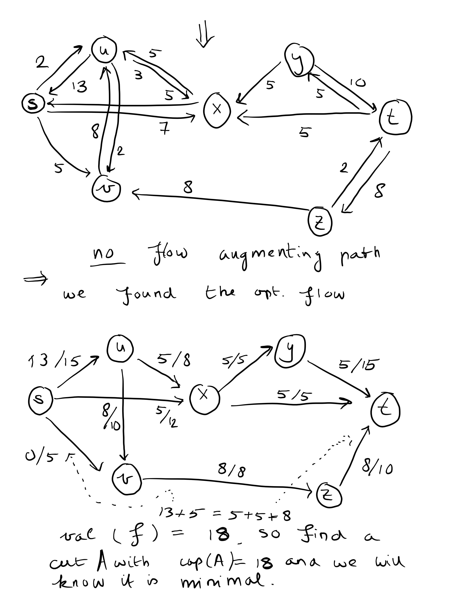
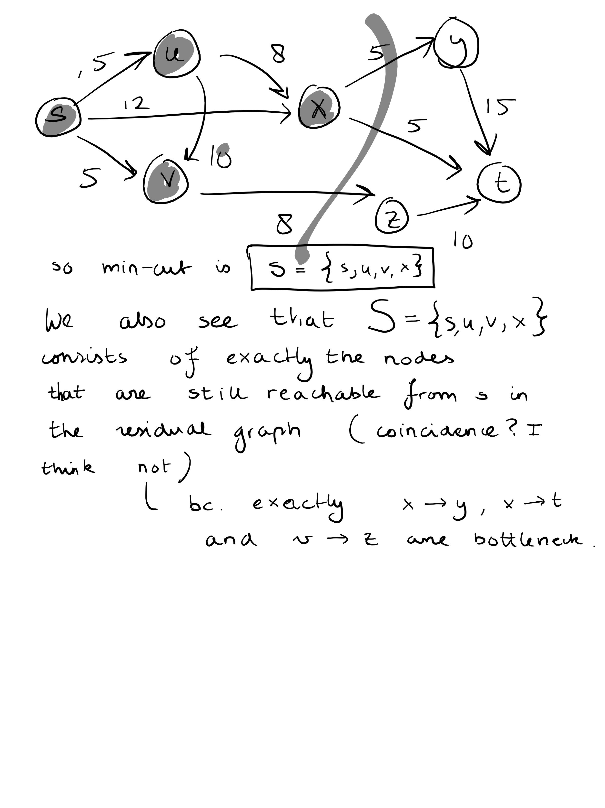
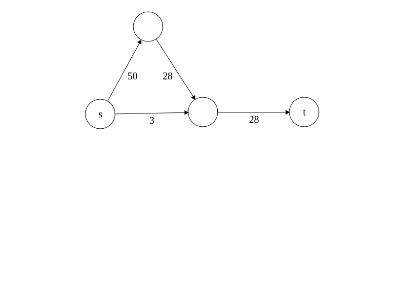
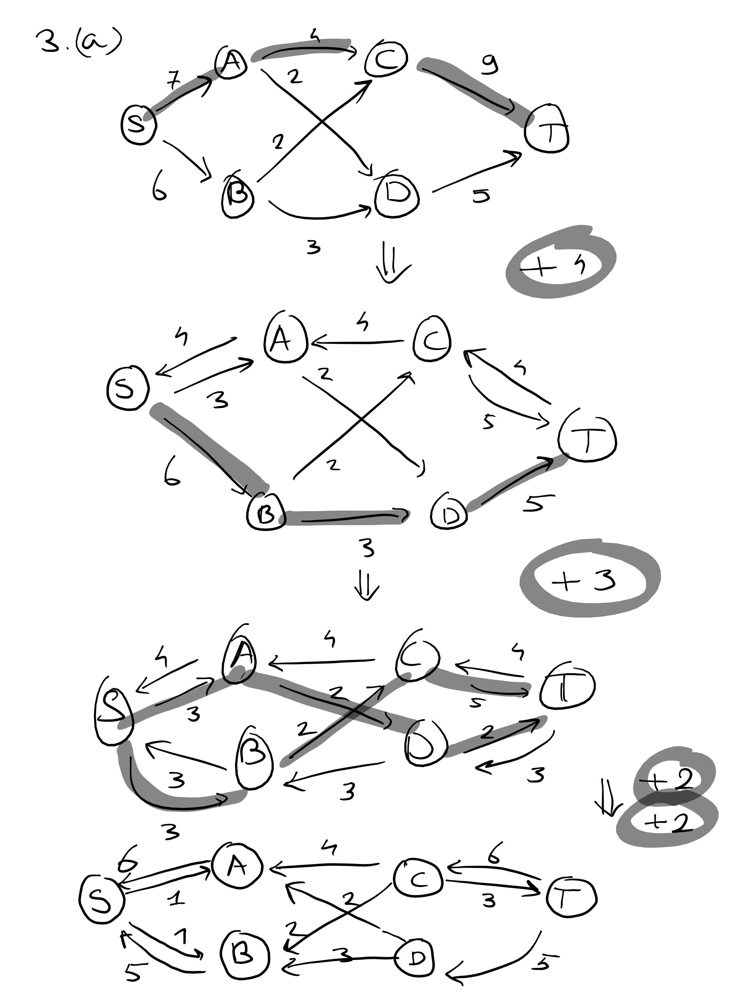
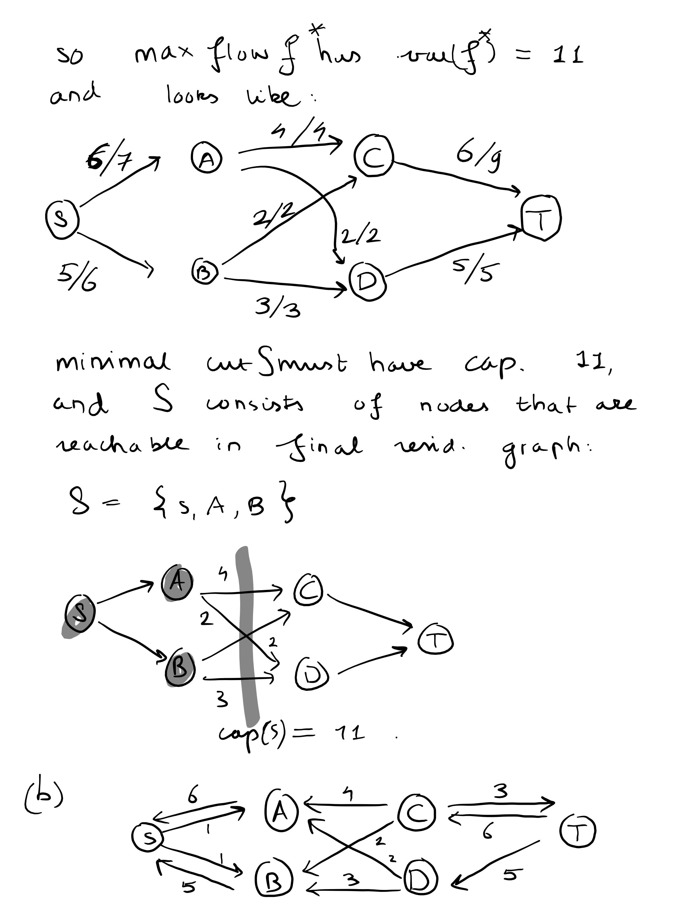
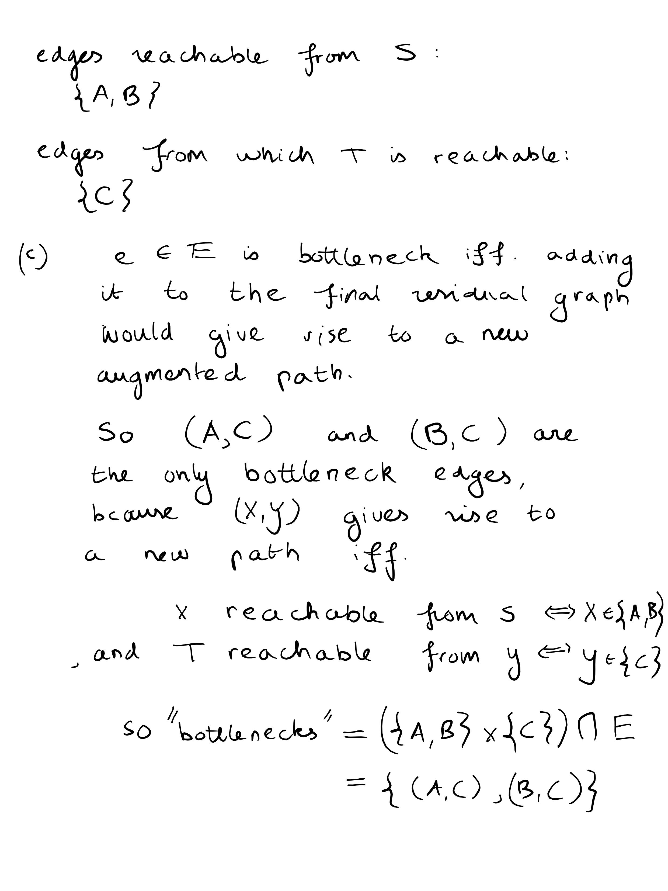
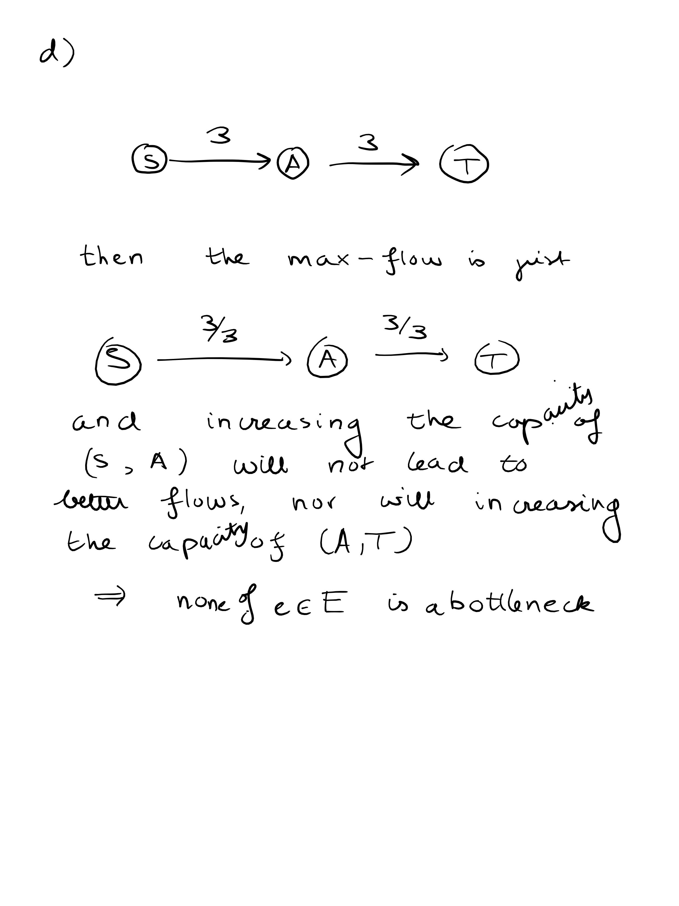

## Exercise 1






## Exercise 2
No, counterexample:



We see that the max flow cannot saturate every edge out of s, since then the top node cannot satisfy the conservation constraint since outflow <= 28 while inflow = 50.

## Exercise 3.
(a)-(d):











(e)
Efficient algorithm: run the ford-fulkerson method to find the max-flow and the min-cut.

You can find the min-cut as discussed in an earlier exercise: when you look for new augmented paths in the residual graph with BFS, you will get a set P of nodes that can be reached from s. And all nodes that are left in the queue of BFS are not reachable, call that set Q. Then all edges in the original graph between P and Q are apparently:

- either edges from P into Q and they are in the residual graph completely reversed (meaning that f(e) = c(e) in the max flow)
- or completely unused by the flow, meaning that they were backward edges from Q into P and still are.

Because otherwise there would be a forward edge from P into Q in the residual graph, meaning that we can reach a node n in Q from S (via P) (but that contradicts our definition of Q).

So this means that all bottleneck edges must be a subset of these edges, because the subset of nodes from which T is reachable cannot contain nodes from P, so it must be entirely inside Q, and all nodes reachable from S are by definition the nodes inside P.

So we still need to find the subset of nodes inside Q from which T is reachable in the residual graph. This is in general not the entirety of Q, as seen in (d) where Q = {A,T} but T is not reachable from A.

We can find this subset using, again, BFS. First, make a graph G''.

G'' consists of all nodes in Q, where there is an edge connecting q and q' iff. e^R connects q' and q in Q. Reversing edges can be done by iterating over all adjacency lists:

```
def reversegraph(G):
    G'.vertices = G.vertices // O(V)

    for v in G.vertices :
        for u in G.adjacent(v):
            G'.adjacent(u).add(v) // O(E)

    return G'
```

So it is O(V + E) to reverse edges in the subgraph with nodes Q of the residual graph. Here V and E are the number of vertices and edges in Q, respectively.

Then running BFS on G'' is O(V+E) (if we use adjacency lists). We find all nodes from which T can be reached (equivalently, all nodes reachable from T in G')

And finally, we take the cartesian product of P and Q and check for every edge in P x Q whether it is an actual edge in the orgininal graph (not the residual, the original), because not all edges in the residual graph are in the original.

Checking this takes at most O(E) time if we use an adjacency matrix, but for adjacency lists we need to search through the list of each edge, giving O(VE) time to search whether a connection actually exists.

All the edges that are in P x Q and an actual edge in the original graph, are botlleneck edges. We see that the lookup O(VE) step dominates everything, so given that we use breadth-first search, we have a total complexity of O((V+E)val(f) + VE)

## Exercise 4.

This is just a bipartite matching problem:

- make a bipartite graph with nodes X and nodes Y, and an edge from a node x in X to a node y in Y if applicant x wants job y.

- the goal is to find a max matching M (a set of edges such that none of the edges share an endpoint), because then none of the applicants get the same job and none of the jobs get more than one applicant.

- next, turn this into an equivalent max-flow problem by adding a source node s and an edge from s into every x in X and adding a terminal node t and an edge from every y in Y into t. Give every edge in the new graph capacity 1.

- a flow in the modified graph gives rise to a matching because there cannot be more flow than 1 into one job or out of one applicant by combining conservation in the applicant/job node and the capacity constraint of the single edge into the applicant/out of the job.

- and the flows over edges f(e) are integer (=> binary) valued because the LP formulation of this problem has a totally unimodular constraint matrix.

- Solve the flow problem => the matching is given by all edges between X and Y that have capacity 1.


## Exercise 5.

We see that if we have a max-flow `f` for the original network, then we can transform this flow into a flow `g` for the new network by setting `g(e) = f(e)` for all edges `e` other than `(u,x), (x,v)`, and by setting `g(u,x)=g(x,v)=f(u,v)`. Note that this flow is admitted because conservation is satisfied in all nodes other than x and in x as well: `inflow(x) = g(u,x) = g(x,v) = outflow(x)`, and moreover `g(u,x) = f(u,v) <= capacity(u,v) = capacity(u,x)` and `g(x,v) = f(u,v) <= capacity(u,v) = capacity(x,v)`, so also capacity is satisfied.

This means that the max-flow of the new network can never be lower.

The other way around, suppose we have a max-flow g of G', the new network. Then since g(u,x) = inflow(x), g(x,v) = outflow(x) and inflow = outflow by conservation, we have g(u,x) = g(x,v). So let f be a flow in the original graph G determined by f(u,v) = g(u,x) = g(x,v), which is well-defined because g(u,v) <= capacity(u,x) = capacity(u,v), and since g satisfied conservation in all nodes, so also in u and v, and f(u,v) contributes to the outflow of u and to the inflow of v in the same amount as g(u,x) and g(x,v) did, f satisfies conservation as well.

So any flow on G' leads to a flow on G with the same value, and the same for G to G'. So an optimal solution to G is one for G' and vice versa.