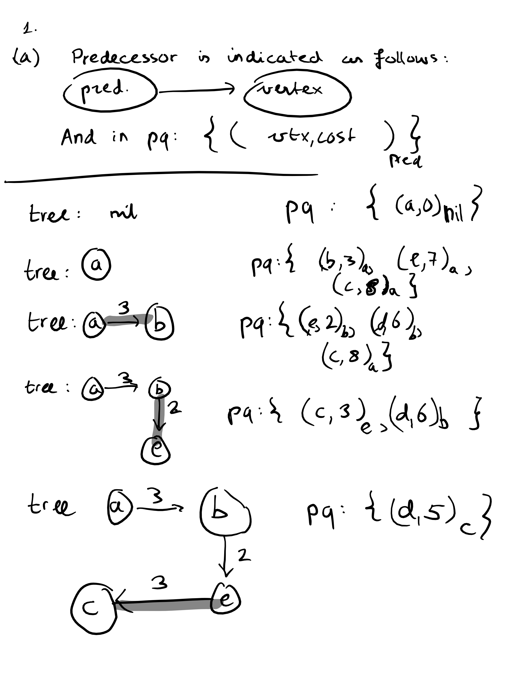
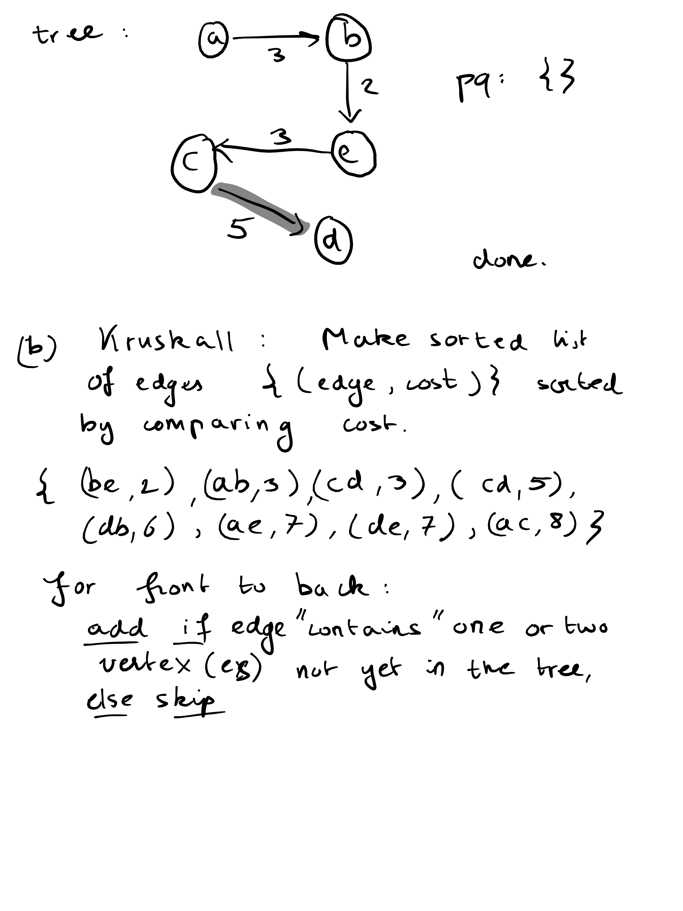
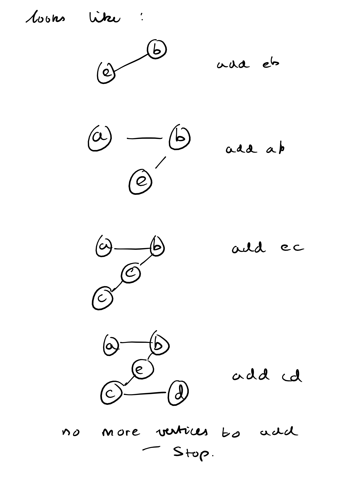

## Exercise 1
(a) + (b):



(c)

Let A = {a_1, ... a_n} be the given array of size n.
We define an **undirected** graph as follows: G_A = (V,E) where

- V = {1, ... , n}
- E = {{i,j}: i != j, i,j in V}

And we define edge costs as c(i,j) = `| a_i - a_j |`, i.e. the absolute difference between a_i and a_j (we assume that the a_i are numbers with an order that satisfies the triangle inequality)

Now pick as the starting node i s.t. a_i = min {a_j : j = 1, .. , n}

We prove that the final MST will be a linked list (i.e. every parent only has one child) such that a_k >= a_j if i is a parent of k in the list. 

We do this by proving the following invariant, with induction to the number of nodes in the tree:

**Invariant** If there are n nodes in the tree, the current MST will be a linked list (i.e. every parent only has one child) such that a_k >= a_j if i is a parent of k in the list, and it will contain the indices such that the (multiset) {a_i : i in current MST} of elements not yet added to the tree contains the n smallest elements of the (multiset) {a_j : from array A} of all elements in the array.

**Proof**:
IB. n = 1
This trivially holds for 1 node and for 2 nodes, because when we arrange them as a tree, they can only be arranged as lists (a tree of one element is a singleton list, a tree of two elements cannot have splits so also is a linked list), and the first node has the minimum value of a_i, so a_i <= a_j for all parents i and children j. Also note that the element a_i_2 added after a_i_1 must be the element closest to 1, by definition of the metric `|a_i - a_j|` and the choice of Prim's algorithm. Hence is the minimal element of all numbers not yet added to the tree, so that {a_i_1, a_i_2} indeed is the *initial segment* of {a_j : from array A}

IS.
Suppose it holds for n-1, which is >= 2. We prove it holds for n.
Suppose that the last three nodes that we added have indices i_{n-2}, i_{n-1}, i_n. Because of the invariant on the tree of n-1 nodes, we must have a_i_1 >= a_i_2 >= ... >= a_i_{n-1} and these form a linked list. 

The only way that we can break the list or order invariant is when a_i_n < a_i_{n-1} somehow, or when i_n will be added as a child of a different node than a_i_{n-1}. We show that both are not possible.

First, a_i_n < a_i_{n-1} is impossible because the current indices in the tree correspond with the minimal initial segment of A, meaning that if a_i_n < a_i_{n-1}, then a_i_n should have already been added to the tree.

So assume a_i_n >= a_i_{n-1}. Now, this means that `| a_i_n - a_j | >= | a_i_n - a_i_{n-1} |` for all j in the current tree. This sounds a bit technical to you, maybe: it simply says that since a_j <= a_i_{n-1} <= a_i_n, we know that a_i_{n-1} will always come *in between* a_j and a_i_n for an j already in the tree, so a_i_n clearly is the closest to a_i_n of all other a_j. If a_j = a_i_{n-1} for some other j because of duplicate elements, I will assume that i_n is still added as a child of parent i_{n-1}. Then, the invariant holds for n elements: because now, i_1, ... , i_{n-1}, i_n form a linked list, and since i_n is the argmin of {a_k : k not yet added}, the current tree is ordered wrt a_i_1 <= ... <= a_i_{n-1} <= a_i_n and contains exactly an n-cardinality initial segment of all elements of the array A (speaking in terms of multisets, of course).

This means that the final resulting tree will also hold the invariant and is hence a sorted, linked list of all elements in the array.

It is practically equivalent to selection sort, where selecting the minimal element not yet added is performed by looking at the absolute distances and ordering these in a priority queue.
## Exercise 2
(a)
```
find_min_cover(set S)
    let x = [x_i for x_i in S] // already sorted, so essentially a min-priority queue
    let intervals = []

    while not x.isEmpty() :
        min_not_covered = x.pop_front()

        // Add an interval starting at the minimum x_i not yet covered, extending 1 to the right.
        intervals.add([min_not_covered, min_not_covered + 1])

        // Remove all elements from S that are covered by the newly added interval
        while x.front() < min_not_covered + 1: 
            x.pop_front()

    return intervals
```

(b)

Correctness:

- Clearly, the algorithm only removes x_i from the queue if they are covered by an interval in ``intervals``. So when the algorithm terminates, ``intervals`` covers S.
- But why is it minimal? 

With induction: suppose length(intervals) = n on return: then we show that n must be minimal with induction to n.


IB.
For n = 1: we added exactly once an interval, so S is **nonempty**. This means that we also need **at least** one interval to cover S, so n = 1 is minimal.

IS. Suppose th algorithm is correct if it returns n-1 intervals on a certain instance. We show that it is correct if it returns n intervals on some (other) instance as well.

Why? If it isn't minimal, let ``minimal`` = {J_1, ... , J_m}, m < n be the actual minimal cover of S. We can shift I_1, the leftmost interval in ``intervals`` = {I_1, .. , I_n}, to the leftmost J_1 in ``minimal``. Since J_1 is leftmost, it must cover x_1, so I_i is shifted to the left or not shifted at all, but it can never be shifted to the right. 

But then, the subset of S of points covered by J_1 can never be larger than that of I_1. W.l.o.g., this means that we can assume the leftmost point x_j not covered by J_1 is equal to the leftmost point not covered by I_1. This means that {J_2, ... J_m} is a cover of 
the set S' = S \ I_1. But S' would be covered by the proposed algorithm with precisely I_2, ... , I_n (because we start at x_j and extend each interval as far to the right as possible again). The proposed algorithm will cover it in n-1 intervals, and by the Induction Hypothesis, this is minimal because the algorithm is correct if it returns n-1. So this means that the cover {J_2, ... , J_m} must have m-1 = n-1, hence m = n, which is a contradiction. So ``intervals`` is indeed a minimal cover.

## Exercise 3
I will start with correcness. I use slice notation S[0:] = S, like in python.

S' is a subsequence of S iff. 

- S'[0] == S[j] for some 0 <= j <= n-1 
- and S'[1:] is a subsequence of S[j+1:]

This means that we simply have to search for the first j such that S[j] == S'[0], and then check whether S'[1:] is a subsequence of S[j+1:]. The greedy part is that we can take the first j, because if there are more indices k at which this holds then we still might have to consider these k's later, or else we skip them when searching for S'[1] which might also equal S'[0].

To show why this can be done in O(n+m), I will give the following implementation:

```
is_subsequence(S', m, S, n)
    if m > n
        return false

    // From now, we know m = O(n)

    index_s = 0
    index_s' = 0

    while index_s' < m && index_s < n:
        if S'[index_s'] != S[index_s]:
            index_s ++

        else: // found first match with S'[index_s']
            index_s' ++
            if index_s' == m:
                break; // we are done: all elements of S' have been found as a subseq of S
            else:
                index_s ++ // we cannot match one element of S with multiple of S' !

    // When here, index_s' == m, or index_s == n.
    // Iff all elements of S' have been matches with a subsequence of S, index_s' == m
    // So this decides whether S' is a subsequence of S
    
    return index_s == m

    
```
The above implemenation searches for the first occurrence of S'[index_s'] in S through incrementing of index_s, and once found, it will increment index_s' to make the loop search for the occurrence after index_s of S'[index_s' + 1] or terminate if it has found the last element of S'. In this case, it will still have increased index_s' to m, which is kind of a sentinel to signal to the scope outside of the while loop that the final element has indeed been found (if we don't do this, we might wonder whether the final element S'[m-1] was found or not.)

Since index_s and index_s' are global variables, we will increment them at most n + m times in total. All operations inside the loop are constant time, so O(n+m). Note however, that by checking m <= n first, we assured `m = O(n)`, so actually the running time is O(m+n) = O(n).


## Exercise 4
We start indexing the array at 1, for simplicity. This means that we have indices 1, ... , n for an array of size n.


```
let x[] = {x_1, ... , x_n} be the list of amounts, unitialized

n[] <- sort {1, ... , n} on {v_1, ... , v_n} in descending order        // O(n log n)
w[] <- sort {w_1, ... , w_n} on {v_1, ... v_n} in descending order      // O(n log n)
v[] <- sort {v_1, ... , v_n} in descending order                        // O(n log n)


// We use an additional array n[] of indices, sorted such that that if 
// v[] = {v_a, v_b, v_c, ...}, then
// w[] = {w_a, w_b, w_c, ...} and
// n[] = {a, b, c, ...}, in other words
// v[j] = v_n[j], we "remember the permutation of the elements"


// Iterate over all materials, in the order of their values v_i
// In other words, they are popped from a max-priority queue where 
// the priority of x_i is v_i

for j = 0, ... n-1:
    if W == 0:
        // Out of total capacity
        break
    else:
        x[n[j]] = min(w[j], W) // add material n[j] until either capacity W or w[j] is reached
        W = W - x[n[j]] // The total leftover capacity is decreased by x[n[j]]
    
return x

// The loop is O(n) times constant-time operations (assingment and maximum-operation of two elements), so  O(n)
```

The total algorithm is 3*O(n log n) + O(n) = O(n log n)

Correctness:

Lemma:

If x_1, ... , x_n maximizes (sum v_i * x_i), then the x_i corresponding to the largest v_i must be "as large as possible", i.e. min(w_i, W).

Proof: Suppose [x_1, ... x_n] is a total value maximizing allocation. If x_i with the largest v_i is not saturated completely, and v_i is the unique maximum value (this is important!), we can improve the total value, because some of the {x_j, j != i} must be nonzero (because W - x_j = sum (x_i : i != j), and if x_j does not saturate either w_i or W then x_j < W so sum (x_i : i != j) > 0). So take one of these j, and subtract from x_j the amount s that can still be added to x_i until it saturates w_i or W (i.e. the "slack"): then we see that the total value increases with s * v_i - s * v_j > 0 (here, use that v_i > v_j since v_i is the **unique** maximum value), thus we conclude that the previous allocation [x_1, ... x_n] was not maximal, contradiction

If v_i is not the unique maximum value, we can consider the problem where we combine each i,j such that v_i = v_j into one decision variable x_i, since it does not matter for the total value anyway which of the x_i associated with the same value v is increased.

Once we saturated the x_i associated with the maximum v_i, we can move on to the next j s.t. v_j is maximum of all {v_1, ... , v_n} \ {v_i}, etc. This is precisely what the above algorithm does, which is why it is correct.