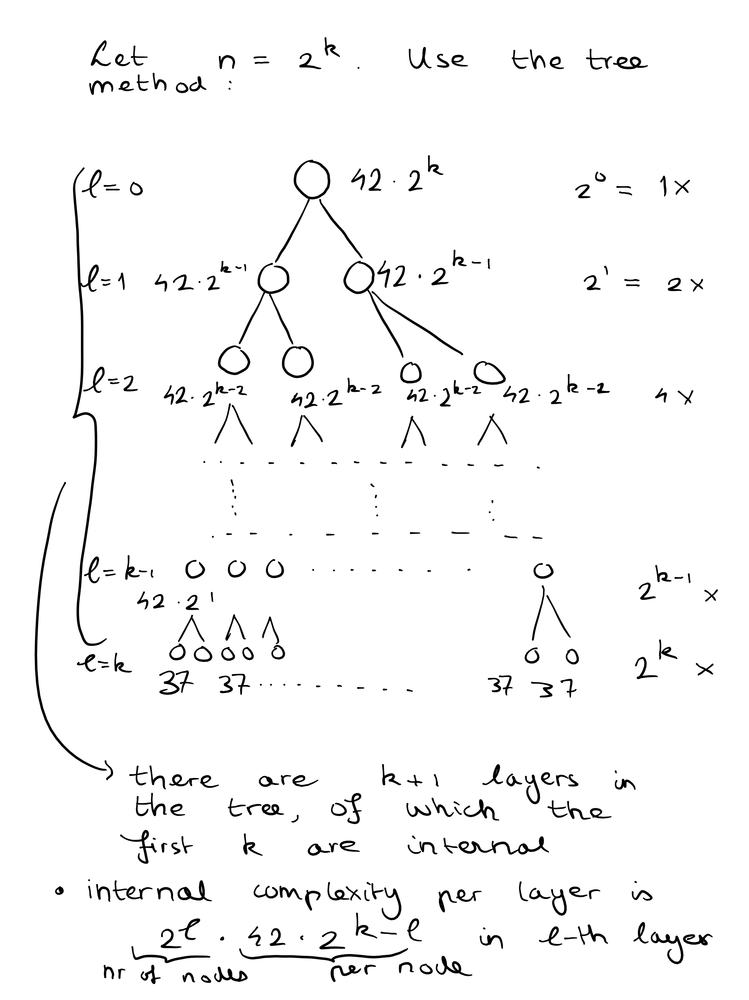
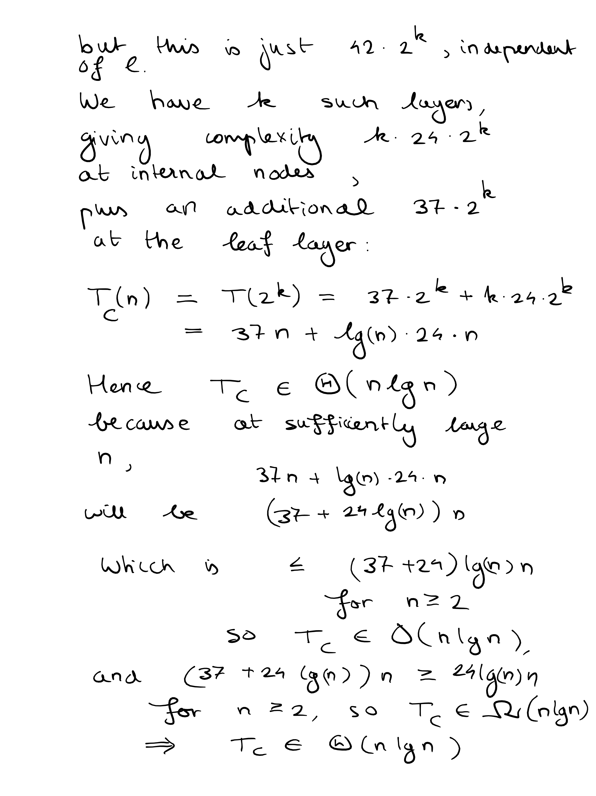
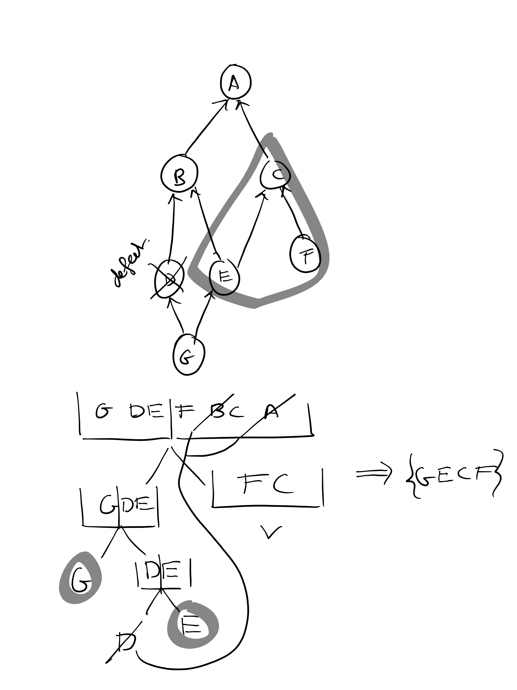

### Ex. 1
a)

For a recurrence relation $T(n) = cT(n-1) + d, n>0, T(0) = 1$, we can do a few steps to see how it behaves:
$$
T(0) = 1 \\
T(1) = c + d \\
T(2) = c(c+d) + d \\
T(3) = c(c(c+d)+d)+d \\
T(n) = c^n + \sum_{m=0}^{n-1}c^n\cdot d
$$
By the geometric formula (which I will not reprove here, since, come on, we are second years now):
$$
\sum_{m=0}^{n-1}c^n = \frac{c^n-1}{c-1}
$$
Which holds for any $c>0$. So we have in general:
$$
T(n) = c^n + d(c^n-1) = (d+1)c^n-d
$$
Hence 
$$
T_A(n) = 38\cdot 2^n - 37 \\
T_B(n) = 43\cdot 3^n - 42
$$

Hence $T_A \in \Theta(2^n)$, $T_B \in \Theta(3^n)$, because $2^n < 38\cdot  2^n - 37 < 38\cdot 2^n$ for $n$ sufficiently large, and $T_B \in \Theta(3^n)$, because $3^n < 43\cdot 3^n - 42 < 43\cdot 3^n$ for $n$ sufficiently large.

Also, we have $\Theta(2^n) \subset O(3^n)$, but not $\Theta(3^n)\subset O(2^n)$, since if there are $n_0$ and $c$ such that $$3^n \leq c\cdot 2^n \text{ for } n> n_0$$, that would imply:
$$
c \geq (\frac32)^n \text{ for all }n >n_0
$$ 
, but the right hand side will eventually grow bigger than any $c$ for $n$ sufficiently large, so that gives the required contradition. Hence 

$T_A \in \Theta(2^n)\subset O(3^n)$, so $T_A \in O(3^n)$. 

But $T_B \not \in O(2^n)$, otherwise we would have $\Theta(2^n) = \Theta(T_B) \subset O(2^n)$, which is not true (we just proved that).

b)




### Ex. 2
Since the integers are distinct, the array contains a strictly increasing sequence of integers, i.e. `a[n+1] >= a[n] + 1`. This implies that if `a[n] > n`, then for all `m > n` we have `a[m] > m`, which can be shown with induction to `k` where `k = m - n`:
IB: `k = 0`: this is just `a[n]>n` which was known.
IH: suppose it holds for a `k`
IS: then `a[m+k+1] >= a[m+k] + 1 > m+k + 1` by IH.

The other way around, if `a[n] < n`, then for all `m < n` we have `a[m]<m` necessarily, which can also be shown with induction to `k = n - m`.

This can be used, because it means that if we for some index `n` compare `a[n]` and ` n`, and it turns out `a[n]< n`, we only have to check at indices `m > n` because we will by the above not find an equality for `n < m`. The other way around, if we find `a[n]>n` then we can continue looking at indices `m < n`, and ignore the rest without losing correctness of our solution.

Hence, an algorithm that checks whether the "middle" element at index lenght(A)//2 is equal to length(A)//2, then recursively: 
- either looks for an index `n == A[n]` to the left of length(A)//2 if lenght(A)//2 > length(A)//2
- or recursively looks for an index `n == A[n]` to the left of length(A)//2 if lenght(A)//2 < length(A)//2
- returns true if the equality holds
Would be correct. Once it arrives at an empty array slice, it has to return false.

So it becomes a variant of binary search, which is certainly divide-and-conquer in a sense, since we split the array, look at the pivot, and are able to discard half of the problem and solve a smaller but equal subproblem.

I will give the python code. This assumes array-indexes start at 0, like in most conventional programming languages:
```python
def findCollision(shift, arr):
    n = len(arr)
    if n == 0:
        return False
    
    else:
        h = n//2
        if arr[h] == shift + h:
            return True
        if arr[h] < shift +  h:
            return findCollision(shift + h + 1, arr[h + 1:])
        else:
            return findCollision(shift, arr[:h])
```
The `shift` argument is needed to keep into account the fact that a subarray may start at an index `shift`>0 if the binary search branches to a slice to the right of a pivot.

Correctness: already shown using the lemma. 

Complexity-wise: A run of `findCollision` on an array of size n will do:
- A O(1) lookup in an array.
- At most two O(1) comparisons of an integer with an integer index.
- <u> One </u> recursive call to findCollision, applied to an array of size n//2, plus minus 1 (depending on whether the array is of odd length and in that case which slice we go to in the recursive step: the longer or shorter one).

Hence $T(n) = T(n/2) + O(1)$, and this recurrence relation is well known to have solution $T(n) \in O(\log n)$. Alternatively, we can argue that the problem size can be halved at most $\log n$ times before we arrive at an empty array slice, so at most $O(\log n)$ recursive calls are needed, and inside the function apart from the recursive call, we only have $O(1)$ operations (comparisons and random-access lookups).

### Ex. 3
We assume wlog that m >= n, otherwise we can establish this by swapping the two arrays (I will call these arrays Sa and Sb for reference).

Suppose that we let idxa = (n-1)//2, and idxb = (m-1)//2, i.e. the indices of the "middle" elements of the two arrays. 

And let the array that would be formed when we merged Sa and Sb be called C = merge(Sa, Sb). Then:

- if idxa + idxb > k:
    - if Sa[idxa] > Sb[idxb], we know C[k] < Sa[idxa], and since Sa[idxa] <= Sa[l] for any l >= idxa , we can immediately discard Sa[idxa:]
    - if Sa[idxa] < Sb[idxb], we know C[k] < Sb[idxb], and since Sb[idxb] <= Sb[l] for any l >= idxb , we can immediately discard Sb[idxb:]
    - if Sa[idxa] = Sb[idxb], we know C[idxa + idxb] = C[idxa + idxb + 1] = Sa[idxa] = Sb[idxb], since when merging the elements Sa[idxa], Sb[idxb] will appear directly after each other and hence will be the k th, k+1 th elements of C respectively. This also means that we can discard Sa[:idxa] and Sb[:idxb], but this requires to 

- if idxa + idxb <= k:
    - if Sa[idxa] > Sb[idxb], we know C[k] > Sb[idxb], and since Sb[idxb] >= Sb[l] for any l <= idxb , we can discard Sa[:idxb+1], but we will have to shift the index k to keep track of the slice offset
    - if Sa[idxa] < Sb[idxb], we know C[k] > Sa[idxa], and since Sa[idxa] <= Sa[l] for any l <= idxa , we can discard Sb[:idxa+1], but we will have to shift the index k to keep track of the slice offset
    - if Sa[idxa] = Sb[idxb], we know C[idxa + idxb] = C[idxa + idxb + 1] = Sa[idxa] = Sb[idxb], since when merging the elements Sa[idxa], Sb[idxb] will appear directly after each other and hence will be the k th, k+1 th elements of C respectively.

    We will always be able to discard half one of the two arrays, leading to an $O(log n + log m)$ complexity.

The above has not discussed the base cases yet:
- Empty Sa: then return Sb[k]. Empty Sb does not happen since n <= m and two empty arrays are not allowed.
- 
    
    
Python implementation:

```
def kthSmallest(k, Sa, Sb):
    n = len(Sa)
    m = len(Sb)

    # establish invariant: n <= m:
    if n > m:
        return kthSmallest(k, Sb, Sa)

    # establish requirement: k <= m + n:
    if k > m + n:
        return None
    
    # Base cases:
    # k == 0 is the only strictly necessary base case. 
    # Other situations can be reduced 
    # by truncating and shifting operations + recursion
    if k == 0:
        return min(Sa[0], Sb[0])
    
    idxa = (n-1)//2
    idxb = (m-1)//2


    if idxa + idxb <= k:
        if Sa[idxa] > Sb[idxb]:
            return kthSmallest(k - idxb - 1, Sa, Sb[idxb+1:])
        elif Sa[idxa] < Sb[idxb]:
            return kthSmallest(k - idxa - 1, Sa[idxa+1:], Sb)
        else:
            return kthSmallest(k - idxa - idxb, Sa[idxa:], Sb[idxb:])

    else:
        if Sa[idxa] > Sb[idxb]:
            return kthSmallest(k, Sa[:idxa], Sb)
        elif Sa[idxa] < Sb[idxb]:
            return kthSmallest(k, Sa, Sb[:idxb])
        else:
            return kthSmallest(k, Sa[:idxa], Sb[:idxb])

```


### Ex. 4
a)
Algorithm: 
1. Partition the set P into two parts Q1 and Q2 (a partition means Q1 and Q2 form P as their union and are disjoint), as evenly as possible, so |Q1| = |Q2| or |Q1| = |Q2|+1 if P has an odd number of packages. Then, call `install(Q1)` and `install(Q2)`. If `install(Qi)` is `success` for one of the two `Qi`, we are done with this subset and know that we can include it in its entirety in the maximal subset. If the unsuccessful `Qi` contains 1 element/package, this element/package must certainly be defect. This means that we can delete the package from the set. The final case is that `Qi` could not be successfully installed, but contained more than 1 element: then, recursively find a maximal subset in Q.

Since we are talking about sets, and taking unions, which are not constant-time operations available in most conventional programming languages (and a programming language's type of (hash)"set" is usually not meant to be iterated over, but rather meant for adding/removing/checking elementhood), I will just give pseudocode:

```
def findMaxPackage(P):
    Q1 = P[:(len(P) - 1)//2]
    Q2 = P[(len(P) - 1)//2:]

    if install(Q1) == fail:
        if size(Q1) == 1:
            Q1' = EmptySet
        else:
            Q1' = findMaxPackage(Q1)
    else:
        Q1' = Q2

    if install(Q2) == fail:
        if size(Q2) == 1:
            Q2' = EmptySet
        else:
            Q2' = findMaxPackage(Q2)
    else:
        Q2' = Q2
    
    return Union(Q1', Q2')
```

Every new call adds a constant number of intall() calls to the complexity, if we don't look at install() calls hidden in recursion. In general, what can we say about the runtime complexity of this algorithm?

My argument is as follows: essentially, a base case (Qi fails and has size(Qi) = 1) is reached iff we found a failing package (not a failing set of packages, but purely one package that fails). In essence, the function install() allows us to look up in constant time whether one of the at most d failing packages is contained in a set. So we are just doing a binary search for at most d failing elements, but we are looking for all failing elements simultaneously using recursion, so the order of operations is mixed a bit compared to separate binary searches (which would be tedious because we would have to remember which of the packages we had already found etc). 

This means that (binary search is log n, given a universe P of n packages) we do at most d (nr. of to be found elements) times the operations of a single binary search, hence the number of calls to install() is in O(d log n)

b)

We cannot use the same algorithm, because if a package is successful, then a partition of the package may give two packages that are not successful without this being caused by defective packages, but this being caused by dependencies between packages in the different blocks of the partition. 

This may lead to a package q being wrongfully classified as defect: for example {q} fails, but this is not because q is defect but rather because q depends on p and p is obviously not in {q}.

If we regard the dependency DAG as the hasse-diagram of a poset, where we have the the relation <, where p <= q if and only p will only work if q is installed, i.e. either p depends on q directly or via a dependency chain to q.

We see that the only sets that might lead to a successful installation if there are no defective packages, are subsets where all dependencies are satisfied, i.e. any chain starting from a maximal element (w.r.t. <=) needs to be contained all the way to a minimal element (w.r.t. <=), i.e. they are the result of all nodes collected in a dfs or bfs tree, where the search traverses dependencies (p,q) in K from q to p.

Idea:

0. topologically sort this graph into an array Psort. 

1. Then look at the initial segment Psort[:(n-1)//2]:
if this fails to install, it is not due to dependencies because this segment is initial so should satisfy the partial ordering and thus contain all dependencies q of p in Psort[:(n-1)//2]. Recursively find a maximal set for this segment then. If it successfully installs, add it to the intermediate maximal set. Also keep a list of uninstallable nodes (either because they are defective or depend on defective nodes): call that Quninstallable.

For the right segment, this segment may fail to satisfy all dependencies.

2. Apply a DFS or BFS to find all p in Psort[(n-1)//2:] that depend on defective nodes in Qdefective. These can never be installed because the nodes that they depend on are defective. So filter them from Psort[(n-1)//2:], and name this P'. Then apply install to P'. If success, we are done. Otherwise, we have a topologically sorted set of which any initial segment will again satisfy the required dependencies, thereby making application of all steps from 1. onward correct.

Since there are d defective elements, and none of the install calls will fail due to missing dependencies, we will only fail to install d times, making for O(d log n) recursive calls which are again just "binary searches" through the poset, giving O(d log n) calls to install.

```
def findMaximalWithDep(P):
    Psort = topoSort(P)
    maximal, uninstallable = findMaximalWithDepRec(P)
    return maximal

def findMaximalWithDepRec(P):
    maximal = emptySet
    uninstallable = emptySet

    firstHalf = P[:(len(P)-1)//2]
    if install(firstHalf) == failure:
        if size(firstHalf) == 1:
            uninstallable = firstHalf
        else:
            maximal, uninstallable = findMaximalWithDepRec(firstHalf)
    
    secondHalf = P[(len(P)-1)//2:]


    uninstallable = bfsAggregate(uninstallable, P)

    secondHalf = filter(not in uninstallable, secondHalf)

    if install(secondHalf) = failure
        if size(secondHalf) == 1:
            uninstallable = Union(uninstallable, secondHalf)
        else:
            m, u = findMaximalWithDepRec(secondHalf)
            maximal = Union(maximal, m)
            uninstallable = Union(uninstallable, u)

    return maximal, uninstallable
         

```
Below is a sketch of an example run on a problem:



- The algorithm fails to install  {GDE}, recursively installs {G} with success, 
- then filters nothing from {DE}, fails to install {DE}, 
- recursively installs {D}, fails, returns D as uninstallable, filters dependencies from D from {E}, which there are none, 
- succeeds to install {E}, returns maximal = {GE}, uninstallable = {D}, 
- filters dependencies from D, which is {BA}, from {FBCA}, applies install({FC}) successfully and returns maximal = {GECF}, uninstallable = {D}, 
- and the driver call returns maximal = {GECF} as is indeed desired