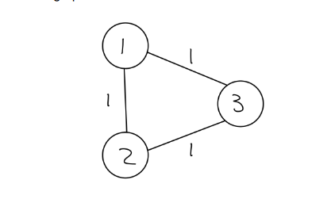

## Today

- Shortest path problem
- Dijkstra's algorithm
- Binary heap & priority queue

## Shortest path

Problem: given
a weighted graph $(V,E, c)$ 
two vertices  $v$ and $w$.
Find the path with the lowest total cost $\sum_{i = 0}^{n-1} c(v_i, v_{i+1})$
s.t. $v_0 = v$, $v_n = w$.

More general: find the shortest path from a source node $v$ to any $w$.

Def
A path from $v$ to $w$ in $G = (V,E)$ is a list `v -> v_1 -> ... -> v_n -> w` of edges.
So we have edge `e_1` from `v` to `v_1`, etc.

Paths can be empty! For example $v$ is connected to itself via an empty path.

A graph is called connected if there is a path from v to w for all vertices v to w.

A directed graph may still be connected if viewed as an undirected graph.

If $G$ is weighted, the the lenght of a path is the sum of the weights $c(e_i)$ of all the edges. and we write $c(p) = $\sum_{i = 0}^{n-1} c(v_i, v_{i+1})$ as the cost of path $p  = [v_0, ... , v_n]$.

We say that a path $p$ from $v$ to $w$ is shortest if for all other paths $p'$ from $v$ to $w$ we have $c(p) \leq c(p')$. It may or may not be unique.

A circuit is a nonempty path from $v$ to $v$. A circuit is a nonempty path containing none of the intermediate nodes (nodes that are not $v_0 = v_n$) more than once.

## Is there always a shortest path?
Given a connected graph $G$, is there always a shortest path


Well, connectedness implies that there is a path. If there is a path, assuming a finite graph (that is, a graph with a finite number of nodes and a finite number of edges connected to each node, or equivalently a finite total number of edges), then due to cycling there may be an infinite number of paths, but if the costs $c(e) \geq 0$ then we also understand that any shortest path should have no cycles, and there are only finitely many paths without cycles, and we can always take the minimum over a finite totally ordered set, so we can find a path that has the shortest lenght of the finite set $\{c(p) \mid p \text{ has no cycles }\}\subset \R$.

This gives us an elementary and very inefficient method of determining the shortest path:

- as none of the shortest paths can contain cycles, we have that we only have to look at paths with lenght of $p$ $\leq \lvert V \rvert$. We can enumerate all of these recursively using DFS or BFS.
- Then we simply have to pick the path that minimizes $c$, which we can do in a linear search over all the generated paths.

Further, we have the following helpful theorem:

If `v -> v1 -> .. -> vn -> w` is the shortest path from `v` to `w`, then for `1<i<j<n` we must have that `p =[vi -> ... -> vj]` is the shortest path from `vi` to `vj`.

**Proof**: By contradiction: if not, then there is a shorter path $q = [v_i, ... v_j]$, but then we can substitute `q` for `p` in the original path `v -> v1 -> .. -> vn -> w` and we will have gotten a shorter path from `v` to `w`, so that is now not the shortest path, contradicting our assumption.

So shortest paths can be characterized recursively: try every neighbour of `v` and look for a shortest path from that neighbour. We could use DFS for this.

But we can also show counterexamples that a completely greedy approach (i.e. one that picks the shortest edge every time) does not work, not even in DAGs:

Suppose, we have a path `v → v1 → . . . → vn → w`, and suppose that
this path is the shortest.
Let e be an edge from w to w', and suppose that e is the shortest
edge with source w.
Is `v → v1 → . . . → vn → w → w′` a shortest path?

No: as a counterexample:



Another question is whether we should always look for paths that have the fewest number of edges:


**Question**:
Suppose, we have a path p as follows: `v → v1 → . . . → vn → w`.
Is the length of p lesser than or equal to the length of
`v → v1 → . . . → vn → w → w′`?
**No**! The length of `w → w′` could be negative! This is why we need to assume
that the weight of every edge is nonnegative.
Also, if there are negative edges, we may also encounter cycles with a total negative cost. In that case, there may not be a shortest path since taking that cycle an arbitrary number of times will get the total path length arbitrarily small.

## Definitions before moving to Dijkstra
First, we define a distance function $d(v,w)$ on nodes $v,w \in V$:
We assume that $c(e)\geq 0$ for all edges $e\in E$. We do not assume connectedness or (un)directedness of the graph.

- $d(v,w) = c(p)$ where $p$ is the shortest path. If such a path does not exist (i.e. $G$ is not connected) we set $d(v,w) = \infty$.

**Properties**:

- $d(v,w)\geq 0$.
- if $G$ is undirected, $d(v,w) = d(w,v)$ (this follows from the definition, check this for yourself)
- Triangle inequality: $d(u,v) \leq d(u,w) + d(w,v)$ for any $v$ (because the RHS is the path lenght of a path that has to go through $v$, whereas on the LHS is the path lenght of the actual shortest path).

## Dijkstra's algorithm

The problem assumptions that we need to make for Dijkstra to be correct:

- G is a weighted graph.
- all edge weights $c(e)\geq 0$

The structure of the search is that of BFS: we explore edges, report intermediate distances and add them to the end of a queue.

In BFS, we keep track of explored vertices and have a queue of vertices which we still need to explore. We add explored neighbours to the queue.

**Difference (1)**: the vertex that we explore next should be the one with the lowest intermediate cost from $v$.

**Difference (2)**: because of this, we do not use an ordinary queue but a priority queue sorted on the intermediate path lenghts.

This makes Dijkstra into a so-called *greedy* algorithm:

(ChatGPT) *Because Dijkstra's algorithm consistently chooses the node with the smallest estimated distance at each step without considering the global context, it exhibits a greedy behavior.*

Its steps are described as:

    Initialization: The algorithm starts with a set of nodes and assigns an initial distance of 0 to the starting node and infinity to all other nodes. It maintains a priority queue (usually implemented using a min-heap) to keep track of the nodes with the smallest current estimated distances.

    Greedy Choice: At each step, Dijkstra's algorithm selects the node with the smallest current estimated distance from the priority queue. This choice is based solely on the information available at that point in the algorithm.

    Relaxation: After selecting a node, the algorithm explores all of its neighbors and updates their distances if a shorter path to a neighbor is found through the currently selected node. This step ensures that the algorithm considers the most efficient path to each neighbor.

    Repeat: The algorithm continues to repeat steps 2 and 3 until it has explored all reachable nodes or until the target node (if one is specified) is reached.

So this is where the word "greedy" comes from.

Concretely, we have the following implementation in pseudocode:

```
void dijkstra(G,v)

    // initialization
    d[v] = 0
    predecessor[v] = NULL
    Q.enqueue({v,0})

    for u in Vertex(G) unequal v
        predecessor[u] = null
        d[u] = INFINITY
        Q.enqueue({u, INFINITY})

    // main loop
    while (!Q.isEmpty())
        u = Q.dequeue()
        for each w in adjacent(u)
            new = d[u] + c(u, w)
            if new < d[w]
                d[w] := new
                predecessor[w] := u
                Q.decreasePriority({w, new})
    

```


## Interface for priority queues

- Return the empty priority queue (O(1))
- Determine whether the priority queue is empty queue (O(1))
- Enqueue: add an element with a priority to the queue (O(log(n)))
- Dequeue: return and remove the front element from the priority
queue (O(log(n)))
- Decrease priority: decrease the priority of an element in the
queue (O(log(n)))

## IMPORTANT: Correctness and Efficiency

### Correctness

We have to argue that the algorithm will indeed calculate d[w] = d(v,w) as we defined it, for every vertex w.

We do this by proving the following invariant:

```
During each step of the algorithm, d[w] is the lenght of the shortest path from v to w using only vertices that are explored (i.e. that are not in Q anymore)

```

Induction basis (initialization): true, since all vertices except v are in Q and d[v] = 0 = d(v,v) indeed.

The main step is to show that the invariant persists throughout the loop.

So suppose that we already explored `v1, ... , vk`, and we next explore `w` which was in `Q` with the lowest priority.

What changes after one iteration of the loop? We update the cost of at most all vertices in `Q` but not outside of `Q`. 

- It is clear that if `u` was in `Q`, we have already explored all paths to `u` through `v1, ... , vk`, and 


## Implementing priority queue using (binary) heap

A heap is a tree data-structure. In the binary case, this means that data elements are stored with a pointer to *child* data elements, and these form a graph without forward, backward or cross edges, and usually there is an orientation of the branches so that we have a root node.

- It is called a max-heap if the value of every element is
larger than the values of its children.
- A heap is called a min-heap if the value of every element is
smaller than the values of its children.
Applications:
- Min-heap priority queues, so Dijkstra
- Max-heap: used for heap-sort algorithm

We usually don't implement heaps with pointers, because that adds overhead which is (in the case of heaps, a special kind of search tree) not necessary:

```
child {
    T data;
    child* child1;
    child* child2;
}
```

This incurs cost of storing pointers. Not necessary, since a heap is always balanced: this means that for any child, the depth of the tree from child1 is at most one more than the depth of the tree from child2 and never less.

Also, the lower-most layer of the heap is filled left-to-right, so we can just use an array to store the children and use appropriate indexing to go from a child to a parent or from a parent to a child:

- for node i, we can go to left child at 2i +1 and right child at 2i+2.
- parent is at i `div` 2, `div` meaning integer division.

By using indices rather than pointer indirections, we are able to save size_heap size(pointer) of memory.


